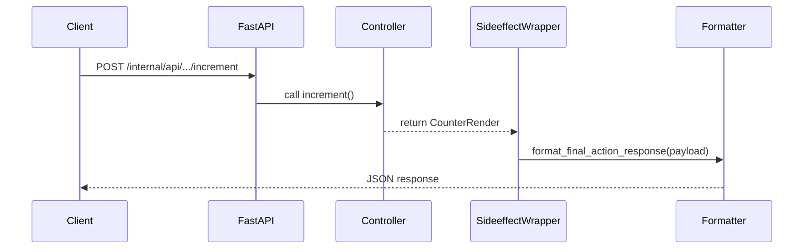
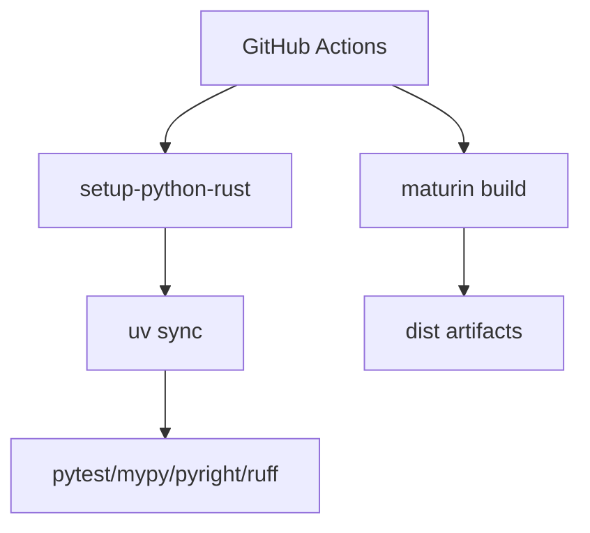
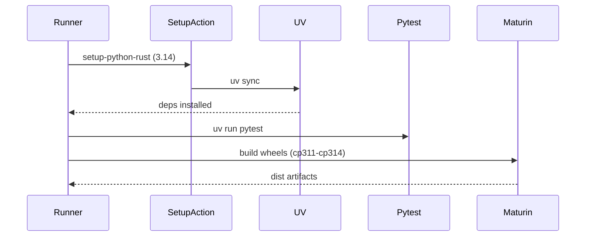
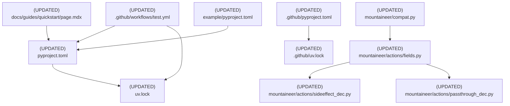

# Design Document: Python 3.14 Support and Drop 3.10

## Overview

### High-Level Description

This change updates Mountaineer to officially support Python 3.14 while dropping Python 3.10.
The work spans packaging metadata, CI/build matrices, lockfiles, and compatibility shims for 3.10-era behavior.
The runtime surface area should remain stable.
We will simplify version-gated code paths to target Python 3.11-3.14 only and align docs with the new range.

### Goals

- Set the minimum supported Python version to 3.11 and add 3.14 to the supported range.
- Update CI, release builds, and lockfiles to test/build for 3.11-3.14 (and stop building 3.10).
- Remove 3.10-specific compatibility fallbacks in runtime typing helpers.
- Update documentation and fixtures to reflect the new supported Python range.
- Keep runtime behavior stable; only compatibility scaffolding should change.

### Non-Goals

- Refactor runtime logic beyond version-gated compatibility changes.
- Introduce new features or deprecate existing APIs unrelated to Python versions.
- Change Rust build tooling, packaging strategy, or distribution format.
- Optimize or re-pin dependencies beyond what is necessary for 3.14 compatibility.

## Workflows

### Workflow 1: Runtime Sideeffect/Passthrough Payload Typing (3.11+)

#### Description

Sideeffect and passthrough actions construct response payloads that use TypedDict generics and NotRequired fields.
With Python 3.10 dropped, we can rely on built-in typing features in Python 3.11+ and remove fallback TypedDict.
Decorators build the payload and hand it off to the response formatter without runtime branching for Python 3.10.

#### Usage Example

```python
from mountaineer.actions import sideeffect
from mountaineer.controller import ControllerBase
from mountaineer.render import RenderBase

class CounterRender(RenderBase):
    count: int

class CounterController(ControllerBase):
    @sideeffect()
    async def increment(self, amount: int) -> CounterRender:
        return CounterRender(count=self.state.count + amount)
```

#### Call Graph

```mermaid
graph TD
    A[Controller method] --> B[@sideeffect decorator]
    B --> C[wraps inner()]
    C --> D[get_render_parameters]
    C --> E[build SideeffectResponseBase payload]
    E --> F[format_final_action_response]
    F --> G[JSONResponse]
```

#### Sequence Diagram



#### Key Components

- **SideeffectResponseBase** (`mountaineer/actions/fields.py:SideeffectResponseBase`) - TypedDict used for
  action payloads
- **sideeffect decorator** (`mountaineer/actions/sideeffect_dec.py:sideeffect`) - Builds sideeffect payloads
- **passthrough decorator** (`mountaineer/actions/passthrough_dec.py:passthrough`) - Builds passthrough payloads
- **format_final_action_response** (`mountaineer/actions/fields.py`) - Serializes action responses

### Workflow 2: CI and Release Matrix for Python 3.11-3.14

#### Description

CI should test and lint against Python 3.11, 3.12, 3.13, and 3.14.
Release builds should produce wheels for the same interpreter set and exclude 3.10.
The rust-tests job should use the minimum supported version (3.11).
Lockfiles in the root and .github projects should be regenerated to reflect updated Python constraints.

#### Usage Example

```python
import sys

if sys.version_info < (3, 11):
    raise RuntimeError("Mountaineer requires Python 3.11 or newer")
```

#### Call Graph



#### Sequence Diagram



#### Key Components

- **CI workflow** (`.github/workflows/test.yml`) - Test, lint, integration, build matrices
- **Setup action** (`.github/actions/setup-python-rust/action.yml`) - Python + Rust setup
- **Project metadata** (`pyproject.toml`) - `requires-python` and dependency constraints
- **Lockfiles** (`uv.lock`, `.github/uv.lock`) - Resolved deps for new range

## Dependencies



## Detailed Design

### Module Structure

```text
./
├── pyproject.toml
├── uv.lock
├── .github/
│   ├── pyproject.toml
│   ├── uv.lock
│   ├── workflows/
│   │   └── test.yml
│   └── actions/
│       └── setup-python-rust/action.yml
├── docs/
│   └── guides/quickstart/page.mdx
├── mountaineer/
│   ├── compat.py
│   └── actions/
│       ├── fields.py
│       ├── sideeffect_dec.py
│       └── passthrough_dec.py
└── example/
    └── pyproject.toml
```

### API Design

#### `pyproject.toml`

Project metadata must reflect the new minimum supported Python version.

```toml
[project]
requires-python = ">=3.11,<3.15"
# Keep existing dependency constraints; verify they support 3.14 during lock refresh.
```

#### `.github/pyproject.toml`

CI scripts should allow Python 3.14 while keeping a conservative upper bound.

```toml
[project]
requires-python = ">=3.11,<3.15"
```

#### `.github/workflows/test.yml`

Update CI matrices and build interpreters to match 3.11-3.14.

```yaml
strategy:
  matrix:
    python-version: ["3.11", "3.12", "3.13", "3.14"]

# rust-tests job should use the minimum supported version
- name: Set up Python 3.11 (min supported version)
  uses: actions/setup-python@v5
  with:
    python-version: "3.11"

# maturin build interpreters
args: -vv --release --out dist --interpreter 3.11 3.12 3.13 3.14
```

#### `mountaineer/compat.py`

Drop 3.10 fallback and rely on Python 3.11+ for StrEnum and Self.

```python
from enum import StrEnum
from typing import Self

__all__ = ["StrEnum", "Self"]
```

#### `mountaineer/actions/fields.py`

Use built-in NotRequired and TypedDict generics without a 3.10 fallback.

```python
from typing import Any, Generic, NotRequired, TypedDict, TypeVar

P = TypeVar("P")

class SideeffectResponseBase(TypedDict, Generic[P]):
    passthrough: P
    sideeffect: NotRequired[Any]
```

#### `mountaineer/actions/sideeffect_dec.py`

Finalize sideeffect payload construction without 3.10-specific typing ignores.

```python
final_payload: SideeffectResponseBase[Any] = {
    "sideeffect": server_data,
    "passthrough": passthrough_values,
}
return format_final_action_response(final_payload)
```

#### `mountaineer/actions/passthrough_dec.py`

Finalize passthrough payload construction without 3.10-specific typing ignores.

```python
final_payload: SideeffectResponseBase[Any] = {
    "passthrough": response,
}
return format_final_action_response(final_payload)
```

#### `docs/guides/quickstart/page.mdx`

Update user-facing documentation to reference Python 3.11+.

```mdx
- Python 3.11 or higher

requires-python = ">=3.11,<3.15"
```

#### `example/pyproject.toml`

Keep example metadata aligned with the supported range.

```toml
[project]
requires-python = ">=3.11,<3.15"
```

## Testing Strategy

- **Unit tests**
  - Re-run `mountaineer/__tests__/test_compat.py` to validate StrEnum behavior under Python 3.11-3.14.
  - Update or add tests in `mountaineer/__tests__/actions/` to ensure sideeffect/passthrough payloads serialize
    with the TypedDict-based payload model (no 3.10 fallback paths).
- **Integration tests**
  - Run existing integration tests (`@pytest.mark.integration_tests`) across Python 3.11-3.14 in CI to validate
    end-to-end behavior.
  - Execute `make test-lib-integrations` in CI matrix to ensure the fixture webapp aligns with new requirements.
- **Version matrix coverage**
  - Ensure CI `test`, `lint`, and `lib-integration-test` jobs cover 3.11-3.14.
  - Ensure `maturin` builds generate wheels for cp311, cp312, cp313, and cp314.

## Implementation

### Implementation Order

1. **Metadata and docs updates** (version range)
   - `pyproject.toml`, `.github/pyproject.toml`, docs, fixtures
2. **Compatibility layer updates** (runtime typing)
   - `mountaineer/compat.py`, `mountaineer/actions/fields.py`, `mountaineer/actions/sideeffect_dec.py`,
     `mountaineer/actions/passthrough_dec.py`
3. **CI/build matrix updates** - `.github/workflows/test.yml` and any related scripts
4. **Lockfile refresh**
   - `uv.lock`, `.github/uv.lock`
5. **Test updates and validation**
   - Any adjustments needed to tests; run full matrix locally or in CI

### Tasks

- [ ] **Update version metadata**
  - [ ] Bump root `requires-python` to `>=3.11,<3.15` in `pyproject.toml`
  - [ ] Update `.github/pyproject.toml` to `>=3.11,<3.15`
  - [ ] Update example `example/pyproject.toml`
  - [ ] Update quickstart docs to reference Python 3.11+

- [ ] **Simplify compatibility shims**
  - [ ] Replace `mountaineer/compat.py` with direct imports from stdlib
  - [ ] Remove 3.10 fallback branch in `mountaineer/actions/fields.py`
  - [ ] Remove 3.10-specific typing ignores in sideeffect/passthrough decorators if no longer needed

- [ ] **Adjust CI/build matrices**
  - [ ] Update test/lint/integration matrices to `3.11, 3.12, 3.13, 3.14`
  - [ ] Set rust-tests min Python to 3.11
  - [ ] Update maturin interpreter list to `3.11 3.12 3.13 3.14`

- [ ] **Refresh lockfiles**
  - [ ] Run `uv sync` (or `uv lock`) in the root project
  - [ ] Run `uv sync` (or `uv lock`) in `.github/`

- [ ] **Testing and validation**
  - [ ] Run `uv run pytest` (unit tests)
  - [ ] Run `uv run pytest -m integration_tests`
  - [ ] Run lint and type checks (`uv run ruff check`, `uv run mypy`, `uv run pyright`)
  - [ ] Verify CI matrix green for 3.11-3.14

## Open Questions

1. Should we set an explicit upper bound in the root `requires-python` (e.g., `<3.15`) until 3.14 support is
   validated?
2. Do we want to keep `typing_extensions` as a direct dependency (for `dataclass_transform`) or migrate to stdlib
   typing now that 3.11 is the minimum?

## Future Enhancements

- Drop additional compatibility branches for pre-3.12 behavior where safe (e.g., Path API signatures).
- Move `dataclass_transform` imports to `typing` and remove typing_extensions reliance in core runtime.
- Add a CI job that validates `pip install mountaineer` on 3.14 in a clean environment.

## Libraries

### New Libraries

None.

### Existing Libraries

| Library | Current Version | Purpose | Dependency Group |
|---------|-----------------|---------|------------------|
| `pydantic` | `>=2.5.3,<3.0.0` | Data validation and models | core |
| `fastapi` | `>=0.114.1,<1.0.0` | Web framework | core |
| `uvicorn[standard]` | `>=0.27.0.post1,<1.0.0` | ASGI server | core |
| `pydantic-settings` | `>=2.1.0,<3.0.0` | Settings management | core |
| `maturin` | `>=1.0,<2.0` | Python/Rust packaging | dev |

## Alternative Approaches

### Approach 1: Keep Python 3.10 Support and Add 3.14

**Description**: Retain 3.10 compatibility shims while adding 3.14 to the CI/build matrix.

**Pros**:

- Less risk for users pinned to 3.10
- Avoids compatibility refactors

**Cons**:

- Higher ongoing maintenance burden
- More branching in runtime type hints and decorators
- CI/build times increase with a larger version matrix

**Why not chosen**: The goal is to reduce maintenance and align with modern Python features.
Dropping 3.10 enables simpler typing constructs and fewer compatibility shims while still supporting 3.11+.

### Approach 2: Drop 3.10 and 3.11, Target 3.12+ Only

**Description**: Raise the minimum to 3.12 to simplify version-specific code further.

**Pros**:

- Simplifies Path API compatibility branches
- Makes it easier to adopt newer typing/runtime features

**Cons**:

- Drops a larger segment of users
- Increases migration burden for downstream projects

**Why not chosen**: 3.11 is still widely used and offers most of the typing/runtime features needed here.
Limiting to 3.12+ is unnecessary for the scope of this change.

### Approach 3: Treat 3.14 as Experimental Only

**Description**: Keep metadata at 3.10+ but add a best-effort 3.14 CI job.

**Pros**:

- Minimal packaging changes
- Allows early signals on 3.14 compatibility

**Cons**:

- Metadata would be misleading for users
- Tooling and lockfiles remain anchored to 3.10 assumptions

**Why not chosen**: The intent is to officially support 3.14 and deprecate 3.10, which requires aligning metadata,
lockfiles, and docs with the actual support policy.
