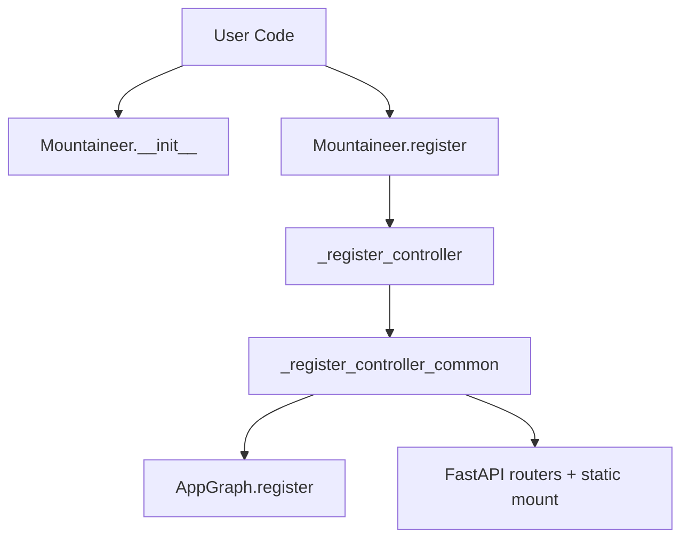
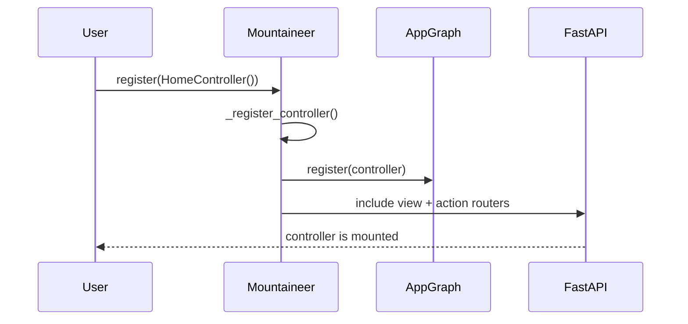
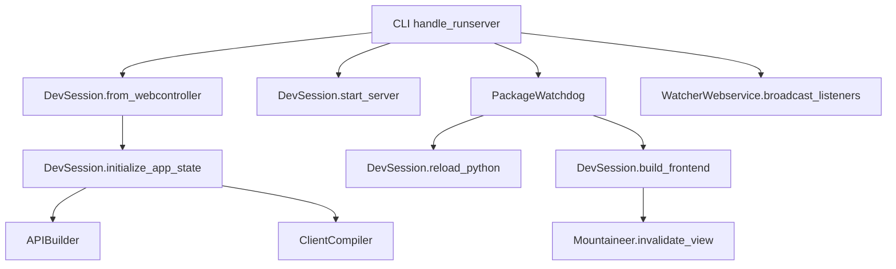
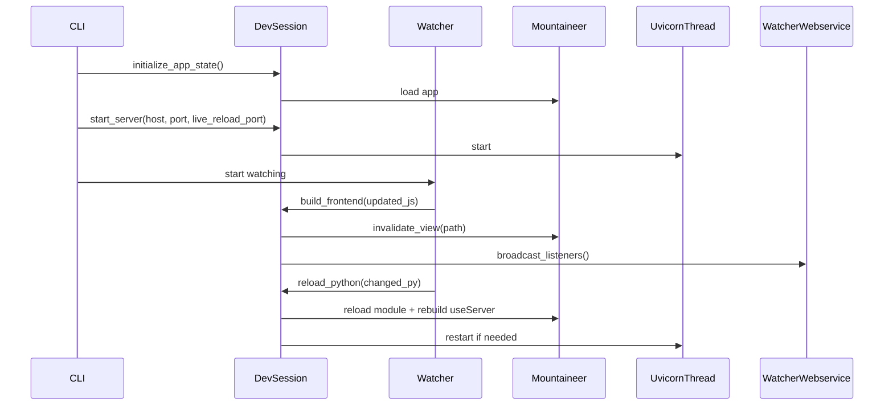
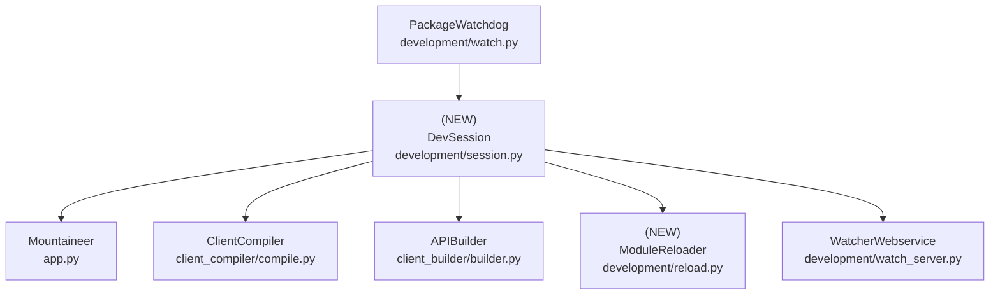

# Design Document: Remove Mountaineer Plugins

## Overview

### High-Level Description

Mountaineer currently ships a plugin system (`MountaineerPlugin`) that allows external packages to register
controllers with separate view roots and precompiled assets. This adds complexity across controller registration,
static asset routing, build pipelines, and dev tooling (including a plugin-based exception page). The request is to
remove plugin support entirely and delete infrastructure that only exists to support plugins, including
`IsolatedAppContext`.

This design removes the `MountaineerPlugin` API and all plugin-only logic from the core, simplifying registration,
build, and runtime assumptions to a single view root. It also replaces the isolated-process development pipeline
with an in-process `DevSession` that manages app initialization and build steps without external plugins. The CLI
(`handle_runserver`, `handle_watch`, `handle_build`) will call this new session directly. Documentation and tests
are updated to reflect the removal and the simplified workflow.

### Goals

- Remove `MountaineerPlugin` and all code paths that register plugins or mount `/static_plugins/...`.
- Simplify build and view-root logic to assume a single project view root.
- Remove `IsolatedAppContext` and the message broker; replace with an in-process dev session.
- Remove the dev exception page functionality without replacement.
- Update CLI, docs, and tests so existing non-plugin workflows keep working.
- Remove dependencies that only exist for the plugin-based workflow.

### Non-Goals

- Removing builder plugins (e.g., PostCSS bundler) or changing the build pipeline semantics.
- Introducing a replacement plugin system.
- Redesigning SSR or the client builder architecture.
- Guaranteeing hot-reload parity with the old isolated-process behavior in edge cases.

## Workflows

### Workflow 1: Register Controllers (No Plugins)

#### Description

Users register `ControllerBase` / `LayoutControllerBase` instances directly on a `Mountaineer` instance. Plugin
objects are no longer supported; static asset routing always uses the default `/static` prefix and the single
project view root. Build steps and dev tooling operate exclusively on that root.

#### Usage Example

```python
from pathlib import Path

from mountaineer import Mountaineer
from mountaineer.client_compiler.postcss import PostCSSBundler

from my_app.controllers.home import HomeController
from my_app.config import AppConfig

mountaineer = Mountaineer(
    config=AppConfig(),
    view_root=Path("views"),
    custom_builders=[PostCSSBundler()],
)
mountaineer.register(HomeController())
```

#### Call Graph



#### Sequence Diagram



#### Key Components

- **Mountaineer** (`mountaineer/app.py:Mountaineer`) - Registers controllers and mounts routes
- **ControllerBase** (`mountaineer/controller.py:ControllerBase`) - Controller definition
- **AppGraph** (`mountaineer/graph/app_graph.py:AppGraph`) - Controller graph + caching
- **ManagedViewPath** (`mountaineer/paths.py:ManagedViewPath`) - View root resolution

### Workflow 2: Dev Runserver/Watch Without Isolation

#### Description

The CLI creates a `DevSession` that loads the Mountaineer instance, initializes builders, runs a dev server, and
watches files. JS/TS/CSS changes trigger frontend rebuilds. Python changes trigger module reload and reinitialization
of the Mountaineer instance. The Watcher webservice broadcasts rebuild notifications. No custom dev exception page
is installed.

#### Usage Example

```python
from mountaineer.cli import handle_runserver

handle_runserver(
    package="my_app",
    webservice="my_app.app:app",
    webcontroller="my_app.app:mountaineer",
    host="127.0.0.1",
    port=8000,
)
```

#### Call Graph



#### Sequence Diagram



#### Key Components

- **DevSession** (`mountaineer/development/session.py:DevSession`) - In-process dev lifecycle
- **PackageWatchdog** (`mountaineer/development/watch.py:PackageWatchdog`) - File watching
- **APIBuilder** (`mountaineer/client_builder/builder.py:APIBuilder`) - useServer generation
- **ClientCompiler** (`mountaineer/client_compiler/compile.py:ClientCompiler`) - frontend build
- **WatcherWebservice** (`mountaineer/development/watch_server.py:WatcherWebservice`) - reload broadcast

## Dependencies



## Detailed Design

### Module Structure

```text
mountaineer/
├── app.py                          # Remove plugin registration path
├── plugin.py                       # Removed (plugin API deleted)
├── client_compiler/
│   ├── base.py                     # Remove _build_enabled filtering
│   ├── compile.py                  # Single view root; no plugin view roots
│   └── postcss.py                  # Remove plugin-root checks
├── development/
│   ├── session.py                  # NEW: DevSession (replaces IsolatedAppContext + broker)
│   ├── reload.py                   # NEW: ModuleReloader utilities
│   ├── manager.py                  # Removed (broker-based workflow deleted)
│   ├── messages.py                 # Removed
│   └── messages_broker.py          # Removed
└── cli.py                          # Use DevSession for runserver/watch/build

mountaineer/__tests__/
├── development/
│   ├── test_session.py             # NEW: DevSession behavior
│   └── test_reload.py              # NEW: Module reload behavior
├── test_cli.py                     # Update to new session
└── client_compiler/
    └── test_compile.py             # Update single-root logic

docs/
├── guides/plugins/page.mdx         # Removed (plugin guide deleted)
├── api/development/page.mdx        # Remove IsolatedAppContext docs
└── api/cli/page.mdx                # Update runserver/watch reload description
```

### API Design

#### `mountaineer/app.py`

Remove plugin registration paths; only allow controllers.

```python
from mountaineer.controller import ControllerBase
from mountaineer.controller_layout import LayoutControllerBase

class Mountaineer:
    def register(self, controller: ControllerBase | LayoutControllerBase) -> None: ...
    # 1. Validate controller is a ControllerBase or LayoutControllerBase
    # 2. Call _register_controller()
    # 3. Raise TypeError for any other object (including prior plugin objects)

    def _register_controller(self, controller: ControllerBase) -> None: ...
    # unchanged behavior
```

#### `mountaineer/development/session.py`

In-process dev lifecycle for watch/runserver/build flows.

```python
from dataclasses import dataclass
from pathlib import Path

from mountaineer.app import Mountaineer
from mountaineer.client_builder.builder import APIBuilder
from mountaineer.client_compiler.compile import ClientCompiler
from mountaineer.development.reload import ModuleReloader
from mountaineer.development.uvicorn import UvicornThread

@dataclass
class DevSession:
    mountaineer: Mountaineer
    js_compiler: APIBuilder
    app_compiler: ClientCompiler
    reloader: ModuleReloader
    webservice_thread: UvicornThread | None

    @classmethod
    def from_webcontroller(cls, webcontroller: str) -> "DevSession": ...
    # 1. Import module and load Mountaineer instance
    # 2. Initialize builders and reloader

    def initialize_app_state(self) -> None: ...
    # 1. Resolve module + controller variable
    # 2. Validate is Mountaineer
    # 3. Create APIBuilder + ClientCompiler

    async def build_use_server(self) -> None: ...
    # 1. Run APIBuilder.build_use_server()

    async def build_frontend(self, updated_js: list[Path] | None) -> None: ...
    # 1. Run ClientCompiler.run_builder_plugins(limit_paths=updated_js)
    # 2. Invalidate updated views on Mountaineer

    async def start_server(self, host: str, port: int, live_reload_port: int) -> None: ...
    # 1. Create UvicornThread if not running
    # 2. Set mountaineer.live_reload_port
    # 3. Start thread

    async def stop_server(self) -> None: ...
    # 1. Stop and join UvicornThread if running

    def reload_python(self, changed_files: list[Path]) -> None: ...
    # 1. Map file paths -> module paths
    # 2. Try ModuleReloader.reload_modules()
    # 3. If reload fails, re-import webcontroller module and rebuild session
    # 4. Re-run build_use_server() after reload
```

#### `mountaineer/development/reload.py`

Utility to reload modules for changed files, with fallback signaling.

```python
from dataclasses import dataclass
from pathlib import Path

from mountaineer.development.packages import package_path_to_module

@dataclass
class ModuleReloader:
    package: str

    def modules_from_paths(self, files: list[Path]) -> list[str]: ...
    # 1. Map file paths into module names
    # 2. De-dup and sort longest-first for submodule reload

    def reload_modules(self, modules: list[str]) -> bool: ...
    # 1. Attempt importlib.reload() for each module
    # 2. Return False on any import error
```

#### `mountaineer/cli.py`

Switch CLI flows to use `DevSession` directly.

```python
from mountaineer.development.session import DevSession

@async_to_sync
async def handle_runserver(...): ...
# 1. Create WatcherWebservice
# 2. Create DevSession.from_webcontroller()
# 3. Initialize + build useServer
# 4. Start server and watch files
# 5. On JS change: build_frontend + broadcast
# 6. On PY change: reload_python + rebuild + restart server

@async_to_sync
async def handle_watch(...): ...
# Same as runserver without starting UvicornThread

@async_to_sync
async def handle_build(...): ...
# 1. Create DevSession
# 2. initialize_app_state + build_use_server + run_builder_plugins
# 3. Compile bundles as today
```

#### `mountaineer/client_compiler/compile.py`

Simplify view-root resolution to a single root.

```python
class ClientCompiler:
    def _get_all_root_views(self) -> list[ManagedViewPath]: ...
    # 1. Return [self.view_root]
    # 2. Ensure package_root_link == root_link
```

#### `mountaineer/client_compiler/base.py` / `postcss.py`

Remove plugin-specific filtering.

```python
class APIBuilderBase:
    def managed_views_from_paths(self, paths: list[Path]) -> list[ManagedViewPath]: ...
    # 1. Convert paths relative to the single root

class PostCSSBundler(APIBuilderBase):
    def mark_file_dirty(self, file_path: Path) -> None: ...
    # 1. Track JS/TS changes without build_enabled filtering
```

## Testing Strategy

Tests should be organized by module/file and cover unit tests, integration tests, and edge cases.

#### `mountaineer/__tests__/development/test_session.py`

- Create `DevSession` from a fixture webcontroller and validate `mountaineer`, `js_compiler`, `app_compiler` are set.
- Verify `build_use_server()` delegates to `APIBuilder` (mocked).
- Verify `build_frontend(updated_js)` calls `ClientCompiler.run_builder_plugins` and invalidates views.
- Verify `start_server()` starts a `UvicornThread` and sets `live_reload_port`.
- Verify `stop_server()` shuts down the thread cleanly.

#### `mountaineer/__tests__/development/test_reload.py`

- `modules_from_paths()` maps file paths to module names.
- `reload_modules()` returns False on import errors (simulate missing module).
- Verify module reload order for nested modules (child modules reloaded before parents).

#### `mountaineer/__tests__/test_app.py`

- Confirm `Mountaineer.register()` accepts only controllers and raises TypeError on unknown objects.

#### `mountaineer/__tests__/client_compiler/test_compile.py`

- Ensure `_get_all_root_views()` returns only the app root.
- Ensure `managed_views_from_paths()` handles paths relative to root and ignores unrelated paths.

#### `mountaineer/__tests__/test_cli.py`

- Patch `DevSession` in `handle_build` and assert expected sequence (`initialize_app_state`, `build_use_server`, `run_builder_plugins`).

**Integration Tests:**

- Run the dev watch loop against `__tests__/fixtures/ci_webapp` and assert JS changes trigger build without errors.
- Run `handle_build` end-to-end and confirm outputs are created in `_static` and `_ssr`.

**Edge Cases to Cover:**

- Python reload fails (syntax error); fallback creates a fresh Mountaineer instance.
- JS change list is empty: `build_frontend` rebuilds all files.

## Implementation

### Implementation Order

1. **Remove plugin API surface** (`mountaineer/plugin.py`, `mountaineer/app.py`)
2. **Simplify build root logic** (`client_compiler/base.py`, `client_compiler/compile.py`, `client_compiler/postcss.py`)
3. **Add in-process dev session** (`development/session.py`, `development/reload.py`)
4. **Update CLI** (`mountaineer/cli.py`)
5. **Remove isolated/broker infrastructure** (`development/isolation.py`, `development/messages*.py`, `development/manager.py`)
6. **Docs and tests** (docs, test updates, remove broker tests)

### Tasks

- [ ] **Remove plugin system**
  - [ ] Delete `mountaineer/plugin.py`
  - [ ] Remove plugin imports + `_register_plugin()` in `mountaineer/app.py`
  - [ ] Remove `/static_plugins` mounting and `_scripts_prefix` overrides
  - [ ] Add explicit TypeError on non-controller registration

- [ ] **Simplify build root logic**
  - [ ] Update `ClientCompiler._get_all_root_views()` to return single root
  - [ ] Remove `_build_enabled` filtering in `APIBuilderBase` and `PostCSSBundler`
  - [ ] Remove `_build_enabled` mutation in `Mountaineer` (now unused)

- [ ] **Replace isolated dev workflow**
  - [ ] Add `DevSession` (initialize/build/start/stop/reload)
  - [ ] Add `ModuleReloader` helpers
  - [ ] Update `handle_runserver`, `handle_watch`, `handle_build` to use `DevSession`
  - [ ] Remove `IsolatedAppContext` and message broker usage

- [ ] **Docs + dependencies**
  - [ ] Remove `docs/guides/plugins/page.mdx`
  - [ ] Update `docs/api/development/page.mdx` to remove isolated context
  - [ ] Update `docs/api/cli/page.mdx` for new reload behavior

- [ ] **Tests**
  - [ ] Add dev session and reload unit tests
  - [ ] Update CLI/build tests
  - [ ] Remove `test_message_broker.py` and related fixtures
  - [ ] Run `uv run pytest`

## Open Questions

1. Should we keep a temporary compatibility shim for `mountaineer.plugin.MountaineerPlugin` that raises a clear error?
2. Should `DevSession.reload_python()` attempt a full process restart when reload fails, or always re-import in-process?

## Future Enhancements

- Add a dedicated CLI flag to disable module reload and force full restart on any Python change.
- Provide a migration guide for users currently relying on plugins (recommended monorepo/package strategies).

## Libraries

### New Libraries

None.

### Existing Libraries

| Library | Current Version | Purpose | Dependency Group |
|---------|-----------------|---------|------------------|
| `watchfiles` | existing | File watching for dev mode | core |
| `fastapi` | existing | Web app framework | core |
| `uvicorn` | existing | Dev server thread | core |

## Alternative Approaches

### Approach 1: Deprecate Plugins Instead of Removing

**Description**: Keep `MountaineerPlugin` working but mark it deprecated, remove docs, and phase out over multiple
releases.

**Pros**:

- Less breaking change for existing plugin users
- More time for migration

**Cons**:

- Continued maintenance burden for plugin paths
- Keeps plugin-only complexity in core for longer

**Why not chosen**: The request is explicit about removing plugins and plugin-only infrastructure now.

### Approach 2: Keep Isolation, Rename `IsolatedAppContext`

**Description**: Replace `IsolatedAppContext` with a renamed class but keep the isolated process + message broker.

**Pros**:

- Preserves existing reload behavior
- Minimal change to dev workflow logic

**Cons**:

- Retains message broker complexity
- Does not meaningfully simplify the codebase

**Why not chosen**: The goal is to remove plugin-only infrastructure and simplify dev tooling, not just rename it.
