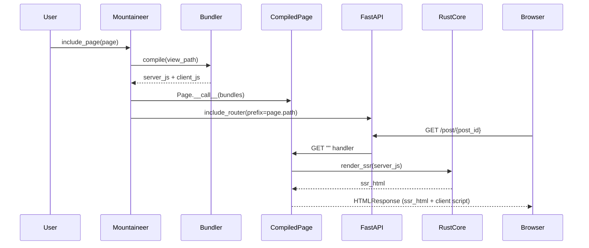
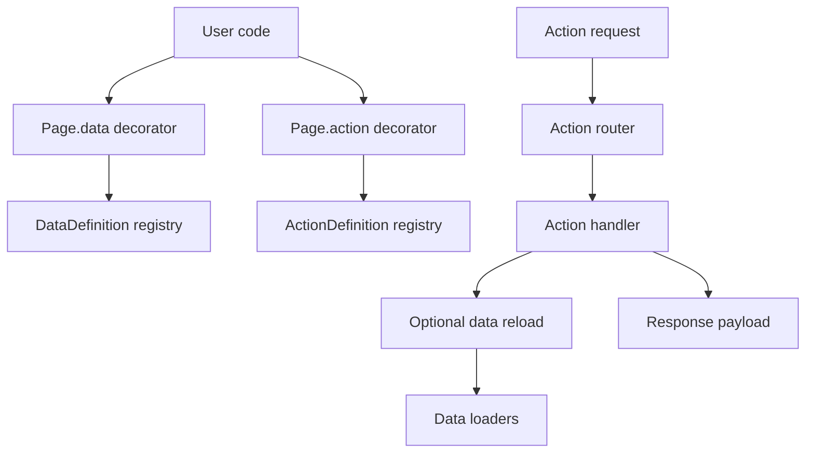
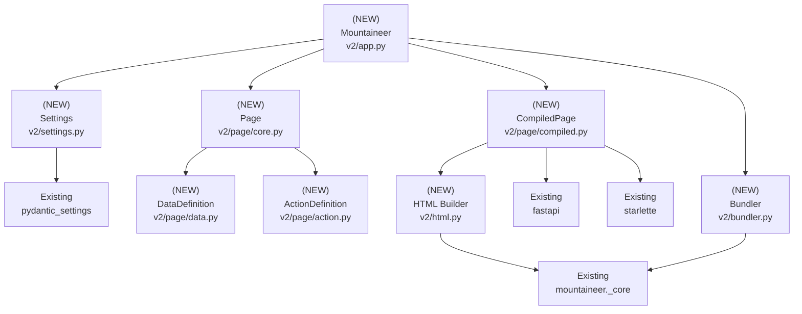

# Design Document: Mountaineer V2 Page API

## Overview

### High-Level Description

Mountaineer V2 introduces a page-centric API.
It mirrors FastAPI routing and fully decouples from V1 controller/graph/layout code.
Instead of a single `ControllerBase.render()` returning a monolithic `RenderBase`, V2 uses a `Page` object.
It includes multiple `@page.data` loaders and a unified `@page.action` decorator.
These model server-side data and client-triggered actions.
A new V2 `Mountaineer` lives under `src/mountaineer/v2/`.
It manages compilation, SSR rendering, and routing without importing V1 modules.
Excluded modules include `controller.py`, `controller_layout.py`, `graph/app_graph.py`, and `app.py`.

Phase 1 delivers a working SSR GET pipeline:

- A `Page` dataclass that becomes a `CompiledPage` when called by `Mountaineer` with compiled JS.
- A `CompiledPage` that builds an `APIRouter` with a GET handler for the page.
- Full server-side render using the Rust core (`mountaineer._core.render_ssr`) and an HTML shell that
  embeds SSR markup and the client bundle (client JS is inlined for Phase 1).
- A V2 `Mountaineer` that can be mounted into a FastAPI app (ASGI-compatible).

Phase 2 (planned) extends the design to execute `@page.data` loaders and `@page.action` endpoints.
It includes selective data reloading on action completion.

### Goals

- Introduce a V2 `Page` API matching the provided example (`@page.data`, `@page.action`,
  FastAPI-like routes).
- Keep V2 isolated in `src/mountaineer/v2/` with no runtime dependency on V1 modules or V1 control flow.
- Use the Rust core (`mountaineer._core`) for JS compilation and SSR execution.
- Provide a mountable V2 `Mountaineer` that exposes an internal FastAPI app and implements `__call__`.
- Implement Phase 1 behavior: GET endpoint renders full SSR HTML using server bundle + client bundle.
- Store metadata needed for Phase 2 data/action execution and reloading without implementing it yet.
- Define explicit mapping from V1 concepts (controller/render/actions) to V2 (page/data/action).
- Provide comprehensive test coverage under `src/mountaineer/__tests__/`.

### Non-Goals

- Implementing V1 compatibility or adapter layers for ControllerBase.
- Implementing layout controllers or hierarchy graphs in V2.
- Implementing data/action execution in Phase 1 (GET only, no data/action evaluation yet).
- Reusing V1 graph/cache/build pipeline modules.
- Building client-side type generation in Phase 1.

## Workflows

### Workflow 1: Register Page and Serve SSR GET

#### Description

User defines a `Page` with a view path and a route path.
The page is registered with V2 `Mountaineer` and mounted into a FastAPI app.
When the route is requested, `CompiledPage` renders the server bundle via `mountaineer._core.render_ssr`.
It builds an HTML shell with SSR markup and embeds the client bundle inline.

#### Usage Example

```python
from pathlib import Path
from fastapi import FastAPI
from mountaineer.v2 import Mountaineer, Page, Settings

settings = Settings(
    view_root=Path("views"),
    node_modules_path=Path("node_modules"),
    PRODUCTION=False,
)

page = Page(view=Path("views/Post.tsx"), path="/post/{post_id}")

mountaineer = Mountaineer(settings=settings)
mountaineer.include_page(page=page)

app = FastAPI()
app.mount(path="/", app=mountaineer, name="website")
```

#### Call Graph

```mermaid
graph TD
    A[User code] --> B[Settings]
    A --> C[Page(...)]
    A --> D[Mountaineer.__init__]
    A --> E[Mountaineer.include_page]
    E --> F[Bundler.compile]
    F --> G[BundleResult(server_js, client_js)]
    E --> H[Page.__call__ -> CompiledPage]
    E --> I[FastAPI.include_router]
    J[HTTP GET /post/{post_id}] --> K[FastAPI router]
    K --> L[CompiledPage.__call__ -> APIRouter]
    L --> M[GET "" handler]
    M --> N[_core.render_ssr(server_js)]
    M --> O[HTMLResponse(SSR + client bundle)]
```

#### Sequence Diagram



#### Key Components

- **Settings** (`src/mountaineer/v2/settings.py:Settings`) - BaseSettings-driven config for env overrides.
- **Page** (`src/mountaineer/v2/page/core.py:Page`) - Declarative page definition (view + path).
- **CompiledPage** (`src/mountaineer/v2/page/compiled.py:CompiledPage`) - Runtime router + SSR rendering.
- **Mountaineer** (`src/mountaineer/v2/app.py:Mountaineer`) - Orchestrates compile + routing.
- **Bundler** (`src/mountaineer/v2/bundler.py`) - Rust core wrapper for server/client bundles.

### Workflow 2: Register Data Loaders and Actions (Planned)

#### Description

User attaches multiple `@page.data` loaders and unified `@page.action` endpoints.
Actions can declare `update=(...)` to indicate which data loaders should be re-fetched after action completion.

#### Usage Example

```python
from uuid import UUID
from mountaineer.v2 import Page

page = Page(view=Path("views/Post.tsx"), path="/post/{post_id}")

@page.data(ssr=True)
async def get_post(post_id: UUID) -> Post:
    ...

@page.data(ssr=True)
async def get_comments(post_id: UUID) -> list[Comment]:
    ...

@page.action
async def generate_random_number() -> int:
    ...

@page.action(update=(get_comments,))
async def update_comment_title(comment_id: UUID, title: str) -> None:
    ...
```

#### Call Graph



#### Key Components

- **DataDefinition** (`src/mountaineer/v2/page/data.py`) - Data loader metadata + SSR flags.
- **ActionDefinition** (`src/mountaineer/v2/page/action.py`) - Unified action metadata.
- **Data registry** (`Page._data`) - Stores `DataDefinition` in declaration order.
- **Action registry** (`Page._actions`) - Stores `ActionDefinition` keyed by name.

## Dependencies



## Detailed Design

### Module Structure

```text
src/mountaineer/v2/
├── __init__.py                 # Export Page, Mountaineer, Settings
├── app.py                      # V2 Mountaineer (ASGI + FastAPI wrapper)
├── bundler.py                  # Rust core wrapper for JS compile
├── html.py                     # SSR + HTML assembly helpers
├── settings.py                 # Pydantic Settings (env-configurable)
└── page/
    ├── __init__.py             # Re-export Page, CompiledPage
    ├── action.py               # ActionDefinition + decorator helpers
    ├── compiled.py             # CompiledPage router factory + SSR GET
    ├── core.py                 # Page dataclass + registry
    └── data.py                 # DataDefinition + decorator helpers
src/mountaineer/__tests__/v2/
├── test_settings.py            # Settings env behavior + defaults
├── test_page.py                # Page registration + decorator behavior
├── test_compiled_page.py       # Router + SSR GET behavior
├── test_mountaineer.py         # include_page + mount + ASGI delegation
├── test_bundler.py             # compile wrapper (mock _core)
└── test_v2_integration.py      # FastAPI TestClient integration
```

### API Design

#### `src/mountaineer/v2/settings.py`

Pydantic Settings object that loads configuration from environment/.env.

```python
from pathlib import Path
from pydantic_settings import BaseSettings, SettingsConfigDict

class Settings(BaseSettings):
    view_root: Path
    node_modules_path: Path
    PRODUCTION: bool = False
    live_reload_port: int = 0
    public_path: str = "/static"
    ssr_timeout: int = 10

    model_config = SettingsConfigDict(
        env_prefix="MOUNTAINEER_",
        env_file=".env",
        extra="ignore",
    )
    # 1. Allow users to override values in .env
    # 2. Provide strong typing for paths and settings
    # 3. Keep V2 config independent of V1 ConfigBase
    # 4. Map PRODUCTION -> bundler environment string
```

#### `src/mountaineer/v2/page/data.py`

Data loader metadata for individual data sources.

```python
from dataclasses import dataclass
from typing import Awaitable, Callable, TypeVar

T = TypeVar("T")

@dataclass(slots=True, kw_only=True)
class DataDefinition[T]:
    name: str
    handler: Callable[..., Awaitable[T]]
    ssr: bool
    # 1. Store function name for keying in response payload
    # 2. Preserve handler for later execution
    # 3. Track SSR eligibility for initial GET
```

#### `src/mountaineer/v2/page/action.py`

Unified action metadata replacing separate sideeffect/passthrough decorators.

```python
from dataclasses import dataclass
from typing import Awaitable, Callable

@dataclass(slots=True, kw_only=True)
class ActionDefinition:
    name: str
    handler: Callable[..., Awaitable[object]]
    update: tuple[str, ...] | None
    # 1. Name defaults to handler.__name__
    # 2. update entries map to DataDefinition.name
    # 3. Future: allow explicit response model and error mapping
```

#### `src/mountaineer/v2/page/core.py`

Page dataclass that registers data/actions and produces a CompiledPage when called.

```python
from dataclasses import dataclass, field
from pathlib import Path
from typing import Awaitable, Callable

from mountaineer.v2.page.action import ActionDefinition
from mountaineer.v2.page.data import DataDefinition
from mountaineer.v2.page.compiled import CompiledPage

@dataclass(slots=True, kw_only=True)
class Page:
    view: Path
    path: str
    _data: list[DataDefinition] = field(default_factory=list)
    _actions: dict[str, ActionDefinition] = field(default_factory=dict)

    def __call__(self, *, server_js: str, client_js: str, ssr_timeout: int) -> CompiledPage:
        ...
    # 1. Construct CompiledPage with server_js/client_js/ssr_timeout and this Page reference
    # 2. Allow Mountaineer to inject compilation results

    def data(self, *, ssr: bool) -> Callable[[Callable[..., Awaitable[object]]], Callable[..., Awaitable[object]]]:
        ...
    # 1. Wrap handler, register DataDefinition(name, handler, ssr)
    # 2. Preserve original function for direct invocation
    # 3. Maintain registration order for deterministic payload ordering

    def action(self, *, update: tuple[Callable[..., object], ...] | None = None):
        ...
    # 1. Wrap handler, register ActionDefinition(name, handler, update_names)
    # 2. If update supplied, translate functions to DataDefinition names
    # 3. Error if update references a non-registered data loader
    # 4. Error on duplicate action name
```

#### `src/mountaineer/v2/page/compiled.py`

CompiledPage builds the router and renders HTML with SSR in Phase 1.

```python
from dataclasses import dataclass
from fastapi import APIRouter
from fastapi.responses import HTMLResponse

from mountaineer.v2.page.core import Page
from mountaineer.v2.html import build_page_html

@dataclass(slots=True, kw_only=True)
class CompiledPage:
    page: Page
    server_js: str
    client_js: str
    ssr_timeout: int

    def __call__(self) -> APIRouter:
        ...
    # 1. Create APIRouter
    # 2. Mount GET "" route that returns HTMLResponse
    # 3. Return router to Mountaineer for include_router(prefix=page.path)

    async def get(self) -> HTMLResponse:
        ...
    # 1. Call build_page_html(server_js, client_js, initial_data={}, ssr_timeout=ssr_timeout)
    # 2. Return HTMLResponse with SSR markup and client bundle
```

#### `src/mountaineer/v2/bundler.py`

Wrapper over Rust core to produce server and client JS for a view.

```python
from dataclasses import dataclass
from pathlib import Path
from mountaineer import _core as mountaineer_rs

from mountaineer.v2.settings import Settings

@dataclass(slots=True, kw_only=True)
class BundleResult:
    client_js: str
    server_js: str

class Bundler:
    def __init__(self, *, settings: Settings) -> None: ...

    def compile(self, *, view_path: Path) -> BundleResult:
        ...
    # 1. Build list[list[str]] paths for the Rust compiler
    # 2. Map settings.PRODUCTION -> environment ("production" | "development")
    # 3. Call compile_independent_bundles(..., is_server=True) for server JS
    # 4. Call compile_independent_bundles(..., is_server=False) for client JS
    # 5. Return BundleResult with both outputs
```

#### `src/mountaineer/v2/html.py`

SSR and HTML assembly helpers for Phase 1 full render.

```python
from json import dumps as json_dumps
from mountaineer import _core as mountaineer_rs


def build_page_html(*, server_js: str, client_js: str, initial_data: dict, ssr_timeout: int) -> str:
    ...
# 1. Execute mountaineer_rs.render_ssr(server_js, hard_timeout=ssr_timeout)
# 2. Serialize initial_data into window.__DATA__ (empty dict for Phase 1)
# 3. Embed SSR markup into <div id="root">...</div>
# 4. Embed client_js as <script type="module">...</script>
# 5. Return complete HTML document string
```

#### `src/mountaineer/v2/app.py`

V2 Mountaineer class that is mountable as an ASGI app.

```python
from fastapi import FastAPI
from starlette.types import Receive, Scope, Send

from mountaineer.v2.bundler import Bundler
from mountaineer.v2.page.core import Page
from mountaineer.v2.settings import Settings

class Mountaineer:
    def __init__(self, *, settings: Settings) -> None: ...
    # 1. Create internal FastAPI app
    # 2. Initialize Bundler with Settings

    async def __call__(self, scope: Scope, receive: Receive, send: Send) -> None: ...
    # 1. Delegate ASGI handling to internal FastAPI app

    def include_page(self, *, page: Page) -> None: ...
    # 1. Compile view via Bundler (server_js + client_js)
    # 2. Build CompiledPage via page(server_js=..., client_js=...)
    # 3. Pass ssr_timeout=settings.ssr_timeout into Page.__call__
    # 4. Include router with prefix=page.path
```

## Testing Strategy

Tests live under `src/mountaineer/__tests__/v2/`.
They should verify SSR rendering, routing, configuration, and compilation behavior.
Use pytest and FastAPI TestClient.
Mock `mountaineer._core` calls for unit tests.

### Unit Tests

- **`test_settings.py`**
  - Loads defaults when optional values omitted (`live_reload_port`, `public_path`, `ssr_timeout`).
  - Reads from `.env` and environment variables with `MOUNTAINEER_` prefix.
  - Validates path types (`view_root`, `node_modules_path`) are coerced to `Path`.
  - Rejects invalid values (e.g., non-int `ssr_timeout`).
  - Confirms precedence order: environment variables override `.env`, which overrides defaults.
  - Ensures unknown env vars are ignored (`extra=\"ignore\"`).
  - Verifies `PRODUCTION` defaults to `False` and can be enabled via env.
  - Rejects empty path values for `view_root` and `node_modules_path`.

- **`test_page.py`**
  - `Page.data(ssr=True)` registers a `DataDefinition` with correct name and flag.
  - Registration order of data loaders is preserved.
  - `Page.action()` registers `ActionDefinition` and stores update mappings.
  - `update=(...)` must reference registered data loaders (raise on unknown).
  - Duplicate action names raise a clear error.
  - `Page.__call__` returns `CompiledPage` with the exact server/client JS and `ssr_timeout` passed in.
  - Decorators preserve original function identity (callable, name, annotations).

- **`test_bundler.py`**
  - Mocks `mountaineer._core.compile_independent_bundles` and verifies calls:
    - Correct `paths` shape (`[[<view_path>]]`).
    - `PRODUCTION` maps to `environment` argument ("production" | "development").
    - `live_reload_port` value from Settings.
    - `is_server=True` call for server JS, `is_server=False` call for client JS.
    - `node_modules_path` is resolved and passed as str.
    - Relative `view_path` is resolved against `settings.view_root`.
  - Returns `BundleResult` with both JS strings.
  - Error handling when compilation raises (propagates with helpful context).

- **`test_compiled_page.py`**
  - `CompiledPage.__call__` returns an `APIRouter` with a GET "" endpoint only.
  - GET handler returns `HTMLResponse` with status 200.
  - HTML contains `div#root` with SSR markup.
  - HTML includes a `window.__DATA__` assignment (empty object for Phase 1).
  - HTML includes inline client bundle script with `type="module"` and bundle contents.
  - `render_ssr` called with configured `ssr_timeout`.
  - When SSR throws (mock `render_ssr`), response propagates error (assert exception raised).

- **`test_mountaineer.py`**
  - `Mountaineer.include_page` compiles and mounts router at `page.path`.
  - Internal FastAPI app contains the page route after registration.
  - `Mountaineer.__call__` delegates to internal FastAPI app (ASGI path dispatch).
  - Multiple pages can be included without route collisions.
  - Same Page instance registered twice follows defined behavior (raise or idempotent).

### Integration Tests

- **`test_v2_integration.py`**
  - Mount Mountaineer into a FastAPI app and request page route via TestClient.
  - Verify path parameter routing works (`/post/{post_id}`).
  - Verify SSR HTML is returned and contains the compiled client script.
  - Verify multiple registered pages resolve correctly.
  - Verify that settings-derived `PRODUCTION` flag does not break routing (dev vs prod).
  - Verify status codes and content types for GET responses.
  - Verify client script is inlined (no external `src`).

### Edge Cases to Cover

- Missing `view` file (compile should raise clear error).
- Empty or invalid `path` strings for Page.
- Long SSR renders respecting `ssr_timeout` (mock timeout behavior).
- Same Page instance registered twice (should raise or be idempotent, define expected behavior).
- Request to page with query parameters does not break SSR pipeline.
- Unusual but valid paths (nested routes, trailing slashes).

## Implementation

### Implementation Order

1. **Settings** (`settings.py`) - env parsing and defaults.
2. **DataDefinition** and **ActionDefinition** (`page/data.py`, `page/action.py`).
3. **Page** (`page/core.py`) - registry + CompiledPage factory.
4. **Bundler** (`bundler.py`) - Rust core wrapper for server/client bundles.
5. **HTML builder** (`html.py`) - SSR call + HTML assembly.
6. **CompiledPage** (`page/compiled.py`) - router + GET handler.
7. **Mountaineer** (`app.py`) - include_page + ASGI mount.
8. **Tests** (unit + integration).

### Tasks

- [x] Implement `Settings` using `pydantic_settings.BaseSettings`
  - [x] Define fields: `view_root`, `node_modules_path`, `PRODUCTION`, `live_reload_port`, `public_path`, `ssr_timeout`
  - [x] Add `SettingsConfigDict` with `env_prefix="MOUNTAINEER_"` and `env_file=".env"`
  - [x] Add minimal validation (positive `ssr_timeout`)
  - [x] Provide a helper to derive `environment` string from `PRODUCTION`
  - [x] Validate `view_root` and `node_modules_path` are not empty paths
  - [x] Document env var names in code comments (e.g., `MOUNTAINEER_VIEW_ROOT`)
  - [x] Add unit tests for env precedence and defaults (`test_settings.py`)

- [x] Implement `DataDefinition` and `ActionDefinition`
  - [x] `DataDefinition` stores name, handler, ssr flag
  - [x] `ActionDefinition` stores name, handler, update mapping
  - [x] Ensure update mapping uses data loader names, not callables
  - [x] Keep `update` as `tuple[str, ...] | None` for stable serialization
  - [x] Add unit tests for basic construction and naming

- [x] Implement `Page` registry and decorators
  - [x] `Page.data(ssr=...)` decorator registers definition and returns original fn
  - [x] Preserve registration order of data loaders
  - [x] `Page.action(update=...)` decorator registers action definition
  - [x] Resolve update entries to data loader names (error on unknown)
  - [x] Prevent duplicate action names
  - [x] Preserve function annotations and name on decorated callables
  - [x] Validate `path` format (must start with `/`, no empty segments)
  - [x] Keep `_data` and `_actions` updated only on successful registration
  - [x] Add tests for success/error/ordering (`test_page.py`)

- [x] Implement `Bundler` wrapper
  - [x] Build `paths` as `[[str(view_path)]]` for Rust core
  - [x] Map `PRODUCTION` to `environment` string for Rust core calls
  - [x] Resolve relative `view_path` against `settings.view_root`
  - [x] Compile server JS with `is_server=True`
  - [x] Compile client JS with `is_server=False`
  - [x] Thread through `PRODUCTION` and `live_reload_port` from Settings
  - [x] Add clear error message when compilation fails
  - [x] Return `BundleResult` with both outputs
  - [x] Add tests with mocked `compile_independent_bundles` (`test_bundler.py`)

- [x] Implement HTML builder (`build_page_html`)
  - [x] Call `_core.render_ssr(server_js, hard_timeout=ssr_timeout)`
  - [x] Inject SSR markup into `<div id="root">` container
  - [x] Serialize `initial_data` into `window.__DATA__`
  - [x] Embed client JS inline as `type="module"` script
  - [x] Ensure `<script>` contents are escaped to avoid premature tag close
  - [x] Return a complete HTML document with `<head>` and `<body>`
  - [x] Add tests validating HTML structure (`test_compiled_page.py`)

- [x] Implement `CompiledPage`
  - [x] Store `Page` reference, server/client JS, and `ssr_timeout`
  - [x] Create `APIRouter` and register GET "" handler
  - [x] GET handler returns `HTMLResponse` with `build_page_html`
  - [x] Ensure GET handler is async and does not accept request body
  - [x] Add tests verifying router and response details (`test_compiled_page.py`)

- [x] Implement `Mountaineer`
  - [x] Instantiate internal FastAPI app
  - [x] Initialize `Bundler` with Settings
  - [x] `include_page` compiles bundles and mounts router with prefix
  - [x] Pass `ssr_timeout` into `Page.__call__`
  - [x] Validate `page.path` is unique per mounted app
  - [x] Add tests for route registration and ASGI dispatch (`test_mountaineer.py`)
  - [x] Provide `__call__` to delegate ASGI
  - [x] Add tests for mount behavior (`test_mountaineer.py`)

- [x] Add integration tests
  - [x] Mount into FastAPI and verify SSR GET
  - [x] Verify path parameters and multiple pages
  - [x] Validate that `Settings` values do not block routing
  - [x] Confirm content type and status codes for GET responses

- [x] Run `uv run pytest`

## Open Questions

1. Should Phase 1 expose an explicit error response (500) when SSR fails, or propagate the exception?

## Future Enhancements

- Execute `@page.data` loaders on initial GET and serialize into `window.__DATA__`.
- Add `@page.action` endpoints with update-driven reload semantics.
- Generate client typings and action helpers from data/action metadata.
- Add static asset handling for production (hashed bundles, static mount).
- Implement caching of compiled bundles for dev vs prod.

## Libraries

### New Libraries

None.

### Existing Libraries

| Library | Current Version | Purpose | Dependency Group |
|---------|-----------------|---------|------------------|
| `fastapi` | existing | Routing + ASGI app | core |
| `starlette` | existing | Responses + ASGI types | core |
| `pydantic-settings` | existing | Settings/.env loading | core |
| `mountaineer._core` | existing | Rust JS bundling + SSR | core |

## Alternative Approaches

### Approach 1: Reuse V1 Controllers Internally

**Description**: Build V2 `Page` as a thin wrapper that constructs a hidden `ControllerBase` and registers it
with the existing V1 `Mountaineer` graph/cache pipeline.

**Pros**:

- Faster to ship (reuses existing routing/SSR/bundling).
- Leverages existing build pipeline and tests.

**Cons**:

- Violates the "no V1 code" requirement.
- Inherits legacy controller semantics (single render data function).
- Harder to evolve toward the new `data`/`action` model.

**Why not chosen**: V2 is a clean break to support a new API paradigm and decouple from controller/graph complexity.

### Approach 2: Keep `Frontend` Dataclass Instead of Settings

**Description**: Continue with a simple dataclass for build configuration instead of `BaseSettings`.

**Pros**:

- Minimal dependency surface and initialization cost.
- Straightforward for programmatic configuration.

**Cons**:

- No .env support for local development or deploy-time overrides.
- Less consistent with FastAPI ecosystem practices.

**Why not chosen**: The V2 API should support environment-driven configuration by default.
