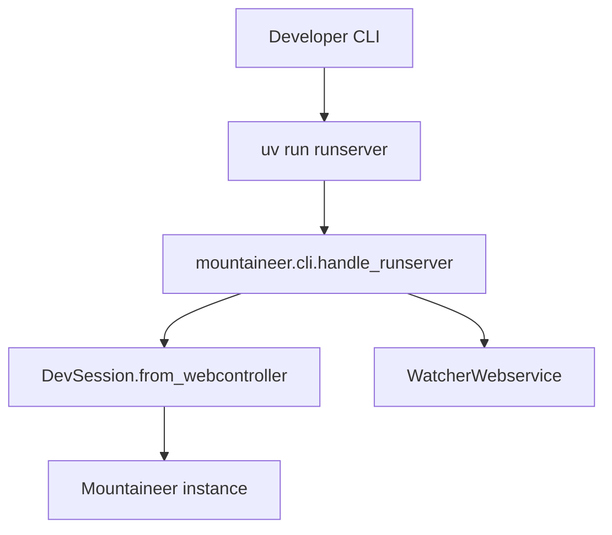
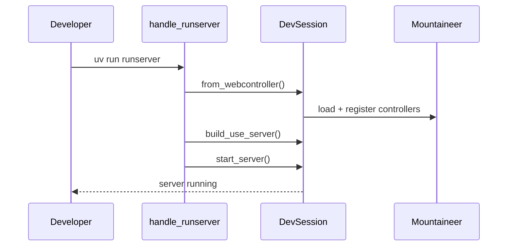
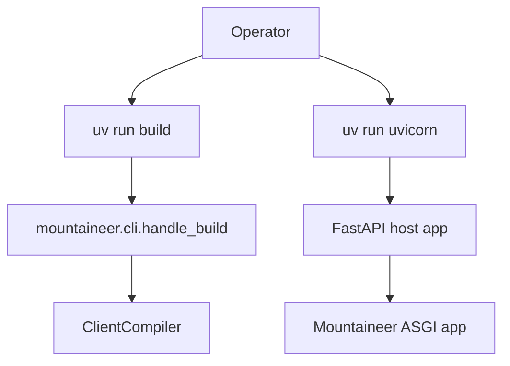
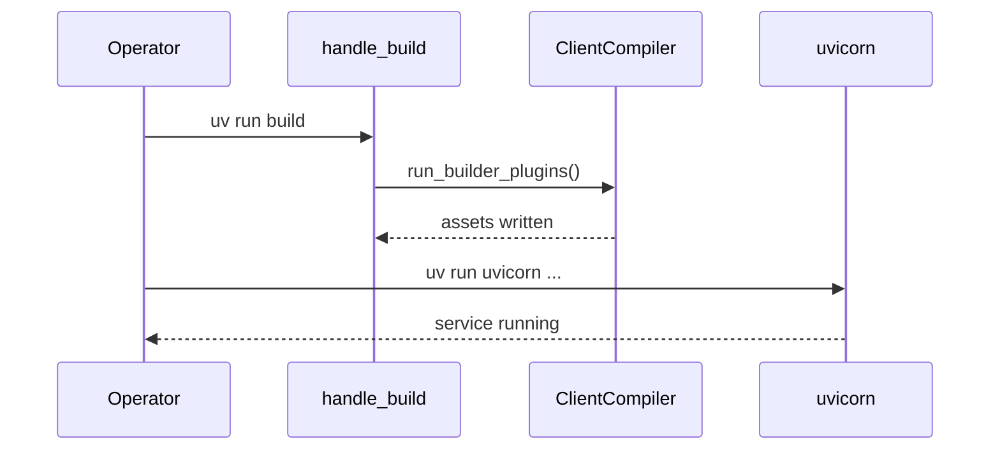
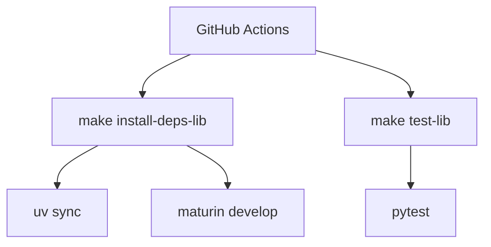
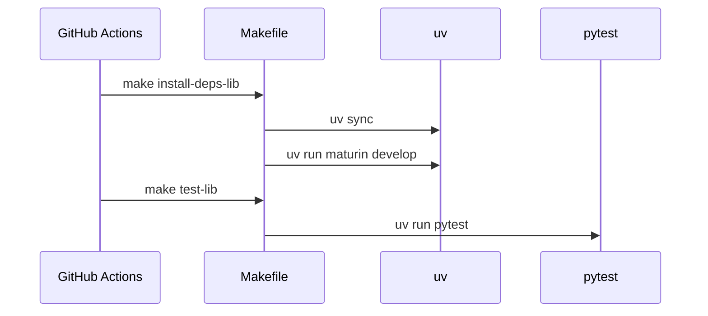
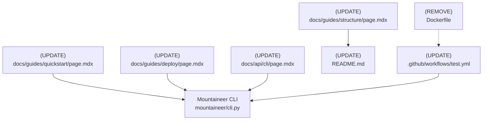

# Design Document: Remove Docker and Postgres Requirements

## Overview

### High-Level Description

The repository currently implies Docker and Postgres are required for development and deployment.
This shows up in the root `Dockerfile` and Docker-first deployment docs.
The quickstart lists Postgres prerequisites and the CLI docs reference the missing `mountaineer.database` module.
CI also spins up a Docker service and passes Docker options into the release build job.

This design removes those requirements by deleting Docker-specific assets and rewriting docs to be container-agnostic.
It also removes Postgres references from the quickstart and CLI documentation.
CI workflows are updated to run without Docker services or Docker-specific build options.
Core runtime behavior and CLI commands remain unchanged.

### Goals

- Remove Docker usage and documentation from the repository (Dockerfile, deploy docs, CI services).
- Remove Postgres prerequisites and `createdb` instructions from the quickstart.
- Remove documentation references to `mountaineer.database.cli.handle_createdb`.
- Keep Mountaineer runtime and CLI behavior unchanged.
- Ensure tests and builds can run without Docker or Postgres installed.

### Non-Goals

- Adding a built-in database layer or migrations CLI.
- Preventing users from deploying with Docker in their own projects.
- Changing SSR/build semantics or existing CLI flags.
- Introducing new build tooling or dependency managers.

## Workflows

### Workflow 1: Local Development Without Docker/Postgres

#### Description

Developers use the existing Mountaineer CLI workflows and in-memory examples.
The quickstart no longer requires Postgres or a database bootstrap step.

#### Usage Example

```bash
uv sync
uv run runserver
```

#### Call Graph



#### Sequence Diagram



#### Key Components

- **Quickstart guide** (`docs/guides/quickstart/page.mdx`) - Database-agnostic walkthrough
- **CLI docs** (`docs/api/cli/page.mdx`) - No database CLI section
- **Mountaineer CLI** (`mountaineer/cli.py`) - Existing runserver workflow

### Workflow 2: Deploy Without Docker

#### Description

Operators install dependencies with uv, build frontend assets, and run uvicorn directly
on the host (VM, bare metal, or PaaS runtime).

#### Usage Example

```bash
uv venv
uv sync --frozen --no-dev
uv run build
ENVIRONMENT=PRODUCTION uv run uvicorn my_webapp.main:app --host 0.0.0.0 --port 3000
```

#### Call Graph



#### Sequence Diagram



#### Key Components

- **Deploy guide** (`docs/guides/deploy/page.mdx`) - Non-container deployment steps
- **Build CLI** (`mountaineer/cli.py:handle_build`) - Existing build behavior

### Workflow 3: CI Build/Test Without Docker

#### Description

GitHub Actions runs tests and lint on standard runners without Docker services.
Release builds use host-based maturin settings and avoid Docker-specific flags.

#### Usage Example

```yaml
- run: make install-deps-lib
- run: make test-lib
```

#### Call Graph



#### Sequence Diagram



#### Key Components

- **CI workflow** (`.github/workflows/test.yml`) - Docker services removed
- **Makefile** (`Makefile`) - Existing install/test targets

## Dependencies



## Detailed Design

### Module Structure

```text
Dockerfile                          # Remove
.github/workflows/test.yml          # Update: drop docker service + docker options
docs/guides/deploy/page.mdx         # Replace Docker instructions with uv-based deploy
docs/guides/quickstart/page.mdx     # Remove Postgres prerequisites + createdb steps
docs/guides/structure/page.mdx      # Remove docker compose.yml from sample tree
docs/api/cli/page.mdx               # Remove Database CLI section
README.md                           # Remove "database" from feature bullet
```

### API Design

#### `docs/guides/quickstart/page.mdx`

```text
# Quickstart
1. Remove "PostgreSQL" from prerequisites.
2. Keep the database-agnostic note; emphasize optional ORM integration.
3. Replace any "uv run createdb" steps with runserver-only instructions.
4. Resolve merge-conflict markers by selecting the in-memory workflow.
```

#### `docs/api/cli/page.mdx`

```text
# CLI Plugins
1. Remove the "Database CLI" section referencing mountaineer.database.cli.
2. Add a short note that database migrations are provided by user-chosen tooling.
```

#### `docs/guides/deploy/page.mdx`

```text
# Deploy (No Docker)
1. Replace container-first narrative with host-based deployment steps.
2. Document uv-based dependency install (uv venv + uv sync --no-dev).
3. Document uv run build to generate static assets.
4. Provide a uvicorn command example for production.
5. Include optional process manager guidance (systemd/supervisor) without Docker.
```

#### `.github/workflows/test.yml`

```yaml
jobs:
  test:
    # 1. Remove docker service block.
  build:
    # 2. Remove docker-options from maturin-action.
    # 3. Set manylinux: off (or equivalent host-based build) on linux targets.
```

#### `README.md`

```text
1. Replace "frontend, backend, and database" with a database-agnostic statement.
2. Ensure no Postgres/Docker prerequisites appear in the README.
```

## Testing Strategy

- Run `uv run pytest` to ensure behavior is unchanged.
- Run `uv run ruff check` to ensure docs and code edits do not introduce lint errors.
- Run `uv run rumdl` (or the repo's markdown lint target) to keep docs formatting consistent.
- Add a quick repo scan to verify no "PostgreSQL" or "Docker" references remain in core docs
  (manual `rg -n "PostgreSQL|Docker|docker compose" docs README.md`).
- Validate CI workflow updates in a dry-run branch before release tagging.

## Implementation

### Implementation Order

1. Remove Dockerfile and Docker-first documentation.
2. Update quickstart and CLI docs to remove Postgres and `createdb`.
3. Update README and structure guide to remove Docker/Postgres references.
4. Update CI workflow to remove Docker services and docker build options.
5. Run lint/tests and verify docs for remaining references.

### Tasks

- [ ] **Docker removal**
  - [ ] Delete `Dockerfile`
  - [ ] Rewrite `docs/guides/deploy/page.mdx` for non-container deployment
  - [ ] Remove `docker compose.yml` from `docs/guides/structure/page.mdx`
- [ ] **Postgres removal**
  - [ ] Update `docs/guides/quickstart/page.mdx` prerequisites and steps
  - [ ] Remove `mountaineer.database` reference from `docs/api/cli/page.mdx`
- [ ] **Doc consistency**
  - [ ] Update README feature list for database-agnostic phrasing
  - [ ] Scan docs for remaining "Postgres" or "Docker" references
- [ ] **CI cleanup**
  - [ ] Remove Docker service from `.github/workflows/test.yml`
  - [ ] Remove Docker build options from release workflow and set host-based build flags
- [ ] **Validation**
  - [ ] Run `uv run ruff check`
  - [ ] Run `uv run pytest`
  - [ ] Run markdown linting (`uv run rumdl`)

## Open Questions

1. Do we accept non-manylinux Linux wheels for releases, or should Linux wheels be dropped until a dockerless
   manylinux strategy is chosen?
2. Should we move Docker-based deployment guidance to an external doc or examples repo for users who still want it?
3. Should CI enforce a strict "no Docker/Postgres references" check across docs?

## Future Enhancements

- Add a dedicated "Deployment Recipes" guide that lives outside the core docs (Docker, Kubernetes, etc).
- Provide an optional database integration guide focused on third-party ORMs and migration tools.
- Add a lightweight docs-lint step to guard against reintroducing Docker/Postgres prerequisites.

## Libraries

### New Libraries

None.

### Existing Libraries

| Library | Current Version | Purpose | Dependency Group |
|---------|-----------------|---------|------------------|
| `uv` | existing | Dependency management and virtualenv | tooling |
| `maturin` | existing | Rust extension builds | dev |

## Alternative Approaches

### Approach 1: Keep Docker/Postgres Docs but Mark Optional

**Description**: Leave Docker and Postgres instructions in place but label them as optional.

**Pros**:

- Minimal changes to existing docs
- Keeps container instructions for users who prefer them

**Cons**:

- Still implies Docker/Postgres are first-class requirements
- Maintains broken references to `mountaineer.database` and `createdb`

**Why not chosen**: The requirement is to remove the need for Docker and Postgres from the repo entirely.

### Approach 2: Move Docker/Postgres Content to a Separate Repository

**Description**: Remove Docker/Postgres references from core docs and maintain them in a separate guide repo.

**Pros**:

- Keeps core docs clean while still offering optional content
- Avoids implying dependencies in the main repo

**Cons**:

- Adds maintenance overhead for another repo
- Requires additional publishing workflows

**Why not chosen**: This adds process complexity beyond the scope of removing requirements from the core repo.
