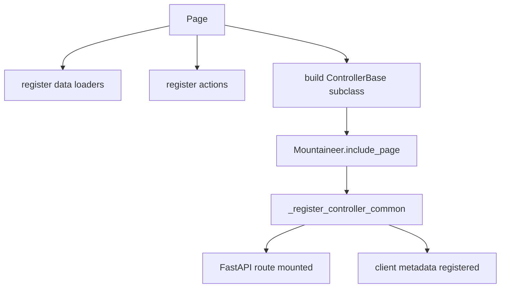
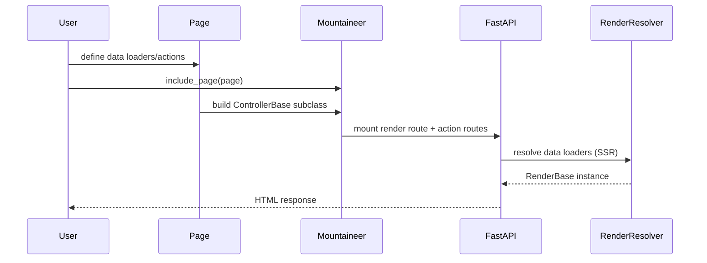
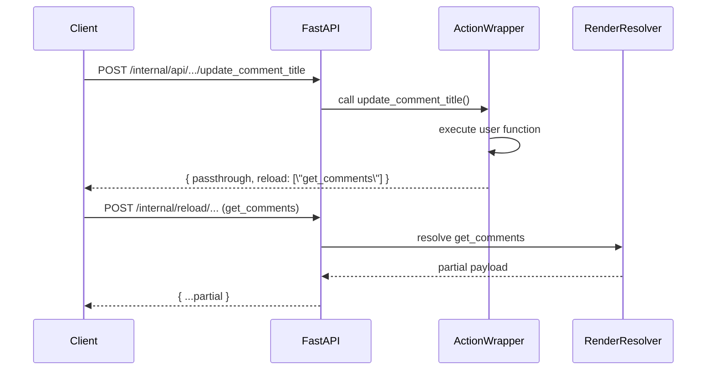
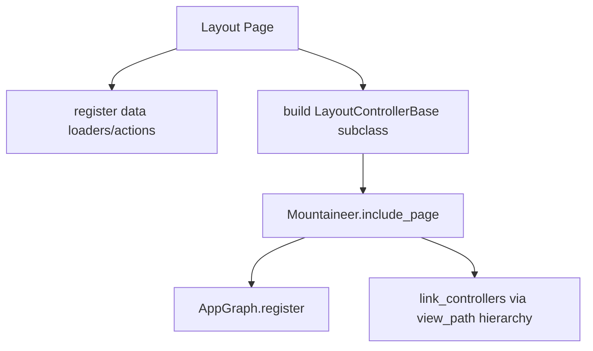
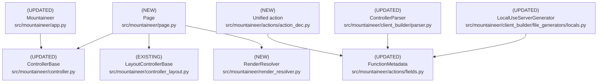

# Design Document: Route-Style Pages with Data Loaders and Unified Actions

## Overview

### High-Level Description

Mountaineer controllers are currently subclasses of `ControllerBase` with one `render()` method.
They also use the `@sideeffect` and `@passthrough` decorators.
This couples data loading into a single method and forces partial reloads to rely on AST cropping.
It also exposes two similar action APIs that differ mostly on whether they trigger state refresh.

This design introduces a route-style **Page** API that mirrors FastAPI routing patterns.
Users create a `Page` object with a `view`, `path`, and optional `params` model.
They then attach data loaders and actions using decorators such as `@page.data(...)` and `@page.action(...)`.
Data loaders and actions behave like thin wrappers around FastAPI endpoints.
They support dependency injection (`Depends`, `Request`, headers, Body/Form/File for reload-only loaders, etc.).
They allow the same return types as FastAPI (primitives, dicts/lists, BaseModel, or Response).
The page’s render model is synthesized from loader return types.
Layouts are expressed via the same `Page` object when `layout=True`, so a single API surface covers pages and layouts.
Pages and layout-pages are registered via `mountaineer.include_page(...)` and attached by view-path hierarchy.
Actions are unified under `@page.action`, with an `update` parameter that determines which data loaders refresh.
For now, update actions instruct the client to re-fetch loader data via a dedicated reload endpoint.
Future optimization: include updated data inline.
Internally, Pages compile to standard controller subclasses.
This keeps the existing registration, graph, and client builder pipelines working.

This design also introduces a dedicated metadata mechanism.
Instead of returning `Metadata` inside a hand-written `RenderBase` instance, pages can define a `@page.metadata` loader.
That loader computes metadata separately.
The resolver merges metadata from `global_metadata`, layouts, and the page using Next.js-like precedence rules.

### Goals

- Provide a route-style Page API consistent with FastAPI routing patterns (`Page(...); @page.data; @page.action`).
- Use a single `Page` API for both pages and layouts via `Page(..., layout=True)`.
- Provide `Mountaineer.include_page` for registration of both pages and layouts.
- Split render data loading into independent, dependency-injected loader functions.
- Unify `@sideeffect` and `@passthrough` into a single `@page.action` decorator.
- Support partial reloads by executing only the loaders specified in `update=(...)`.
- Provide a clear metadata loading/merging mechanism for titles, links, and scripts.
- Preserve existing `ControllerBase` functionality and generated client APIs.
- Offer a clear migration path from class-based controllers.

### Non-Goals

- Remove or break existing class-based `ControllerBase` controllers.
- Redesign SSR, static asset resolution, or the client runtime protocol.
- Introduce new external dependencies.
- Redesign the action payload contract beyond adding a `reload` instruction for update actions.

## Workflows

### Workflow 1: Route-Style Page Definition with Data Loaders

#### Description

A user creates a `Page` with a view and path, defines data loaders with `@page.data`, and actions with `@page.action`.
Data loaders behave like FastAPI handlers.
They can use `Depends`, `Request`, headers, and receive path/query parameters via the standardized `params` model.
They can return standard FastAPI response bodies (primitives, dict/list, BaseModel).
The `Page` compiles into a `ControllerBase` subclass that Mountaineer can register and parse for client generation.
The render model is synthesized from loader return types.
The page author does not need to write a `RenderBase` class unless they want explicit control.

#### Usage Example

```python
from pathlib import Path
from pydantic import BaseModel
from uuid import UUID, uuid4

from mountaineer import Mountaineer, Page

class PostParams(BaseModel):
    post_id: UUID

class Post(BaseModel):
    id: UUID
    title: str
    body: str
    author: str

class Comment(BaseModel):
    id: UUID
    post_id: UUID
    text: str
    author: str

page = Page(view=Path("views/Post.tsx"), path="/post/{post_id}", params=PostParams)
root_layout = Page(view=Path("views/app/layout.tsx"), layout=True)

POSTS = {
    uuid4(): Post(
        id=uuid4(),
        title="Building a React Framework in Python",
        body="This is a post about building a React framework...",
        author="Alice",
    )
}

COMMENTS = {
    list(POSTS.keys())[0]: [
        Comment(id=uuid4(), post_id=list(POSTS.keys())[0], text="Great post!", author="Bob"),
        Comment(id=uuid4(), post_id=list(POSTS.keys())[0], text="Very informative", author="Charlie"),
    ]
}

@page.data(ssr=True)
async def get_post(params: PostParams) -> Post:
    return POSTS.get(
        params.post_id,
        Post(id=params.post_id, title="Post not found", body="", author=""),
    )

@page.data(ssr=True)
async def get_comments(params: PostParams) -> list[Comment]:
    return COMMENTS.get(params.post_id, [])

@page.action
async def generate_random_number() -> int:
    return random.randint(0, 100)

@page.action(update=(get_comments,))
async def update_comment_title(comment_id: UUID, title: str) -> None:
    pass

mountaineer = Mountaineer(view_root=Path("views"))
mountaineer.include_page(root_layout)
mountaineer.include_page(page)
```

#### Call Graph



#### Sequence Diagram



#### Key Components

- **Page** (`src/mountaineer/page.py:Page`) - Route-style page definition and builder
- **Mountaineer.include_page** (`src/mountaineer/app.py`) - Registers pages and layout-pages
- **RenderResolver** (`src/mountaineer/render_resolver.py:RenderResolver`) - Executes loader functions
- **ControllerBase** (`src/mountaineer/controller.py:ControllerBase`) - Compiled target class

### Workflow 2: Unified Action with Targeted Data Reload

#### Description

Actions are declared via `@page.action`.
If `update` is not provided, the action is a passthrough (no render refresh).
If `update` is provided, the action is treated as a sideeffect and returns a reload instruction.
The client then invokes a dedicated reload endpoint to re-run only the specified data loaders.
The resulting partial payload is applied to state.
This mirrors FastAPI semantics while avoiding partial model validation issues.
Future optimization: inline the updated payload to avoid the extra request.

#### Usage Example

```python
@page.action(update=(get_comments,))
async def update_comment_title(comment_id: UUID, title: str) -> None:
    ...
```

#### Call Graph

```mermaid
graph TD
    A[Client action call] --> B[FastAPI action route]
    B --> C[@page.action wrapper]
    C --> D[execute user function]
    C --> E[return reload instruction]
    A --> H[Reload endpoint]
    H --> I[RenderResolver.resolve(partial)]
    I --> J[Partial payload]
```

#### Sequence Diagram



#### Reload Endpoint Contract

- **Path**: `/internal/reload/{controller}` (controller name matches existing internal API prefix)
- **Method**: `POST`
- **Request shape**:
  - Path/query parameters follow the page’s URL signature (same as initial render).
  - JSON body: `{ "loaders": ["get_comments", "get_post"] }`
  - If any target loader requires Body/Form/File, the request body must include those fields and the loader must be
    marked `ssr=False`.
- **Response shape**:
  - `{ <partial RenderModel fields> }` (same shape as initial render payload, but partial)
  - Field names use Python loader names; TS output camelizes them (e.g., `get_my_posts` → `getMyPosts`).
- **Errors**:
  - Unknown loader names → 400 with a structured error.
  - Loader requires Body/Form/File but missing inputs → 422 (FastAPI validation).

#### Key Components

- **page.action decorator** (`src/mountaineer/page.py:Page.action`) - Unified action entrypoint
- **FunctionMetadata** (`src/mountaineer/actions/fields.py:FunctionMetadata`) - Stores update targets
- **RenderResolver** (`src/mountaineer/render_resolver.py`) - Computes partial updates
- **applySideEffect** (`src/mountaineer/static/api.ts`) - Handles reload instructions and applies partial data
- **Reload endpoint** (`src/mountaineer/app.py`) - Fetches updated loader payloads

### Workflow 3: Layout Pages via `layout=True`

#### Description

Layouts are defined using the same `Page` API with `layout=True`.
Layout pages are not mounted to a URL.
Instead, they attach to pages via view-path hierarchy, matching the current `LayoutControllerBase` behavior.
Layout loader data is merged into the SSR payload and can be reloaded by actions declared on the layout itself.
To align with Next.js layout semantics, layout loaders do not receive a `Request` object.
They should rely on `params` and `Depends()` instead.
Body/Form/File are not allowed in layout loaders.

#### Usage Example

```python
root_layout = Page(view=Path("views/app/layout.tsx"), layout=True)

@root_layout.data(ssr=True)
async def get_nav_items() -> list[str]:
    return ["Home", "Posts", "About"]

mountaineer = Mountaineer(view_root=Path("views"))
mountaineer.include_page(root_layout)
mountaineer.include_page(page)
```

#### Call Graph



#### Key Components

- **Page(layout=True)** (`src/mountaineer/page.py:Page`) - Route-style layout definition
- **LayoutControllerBase** (`src/mountaineer/controller_layout.py`) - Layout controller base class
- **AppGraph.link_controllers** (`src/mountaineer/graph/app_graph.py`) - Layout/page hierarchy linking

### Workflow 4: Metadata Loading and Merging

#### Description

Pages and layout-pages can declare a `@page.metadata` loader that returns a `Metadata` instance.
The loader is independent of other data loaders.
It only relies on params and dependency injection (similar to Next.js `generateMetadata`).
The resolver collects metadata from layout-pages in hierarchy order and merges it with the page’s metadata.
Metadata loaders run during SSR/full render only (not on reload updates), matching Next.js behavior.
The merged metadata is attached to the `RenderBase` instance and used by the existing SSR pipeline.

#### Usage Example

```python
from mountaineer import Metadata

@root_layout.metadata
async def base_metadata() -> Metadata:
    return Metadata(title="My Blog", scripts=[], links=[])

@page.metadata
async def page_metadata(params: PostParams) -> Metadata:
    return Metadata(title=f"Post {params.post_id}")
```

#### Merge Rules (Next.js-style)

- **Global metadata**: `Mountaineer.global_metadata` behaves like the root layout and is always the base layer.
- **Title**: page title overrides layout title if provided (layout provides defaults).
- **Links/Scripts/Meta**: concatenated in root → layout(s) → page order.
- **De-duplication**: tags with the same identity (e.g., `name`, `property`, or `rel+href`) are overridden by the most
  specific layer, matching Next.js semantics.
- **Theme/Viewport**: page overrides layout if provided; otherwise inherit from nearest layout/global.
- **Explicit Response**: if a page render returns an explicit response, metadata is ignored (existing behavior).

## Dependencies



## Detailed Design

### Module Structure

```text
src/mountaineer/
├── actions/
│   ├── action_dec.py               # Unified @action decorator
│   ├── fields.py                   # Extend metadata for update targets
│   ├── passthrough_dec.py          # Wrapper -> @action(update=None)
│   └── sideeffect_dec.py           # Wrapper -> @action(update=(...))
├── page.py                         # Page definition + decorators (layout flag)
├── controller.py                   # Render signature helpers for Page-built controllers
├── controller_layout.py            # Existing layout controller base
├── render_resolver.py              # Resolve render models from data loaders
├── app.py                          # include_page registration
├── client_builder/
│   ├── parser.py                   # Parse render signature + action metadata
│   └── file_generators/locals.py   # applySideEffect based on unified actions
└── __tests__/
    ├── page/                        # Page API tests (including layout flag)
    ├── actions/test_action_dec.py   # Unified action behavior
    ├── render/test_resolver.py      # Loader resolution + partial reloads
    └── metadata/                    # Metadata loading/merging tests
example/
└── src/example/controllers/         # Update examples to Page API
```

### Internal Changes (Layouts + Registration)

- **Registration API**: add `Mountaineer.include_page(page)` entrypoint.
  It accepts both pages and layout-pages.
  - If `page.layout is False`: build a `ControllerBase` subclass with `url`.
    Register it via `_register_controller_common`.
  - If `page.layout is True`: build a `LayoutControllerBase` subclass with no URL.
    Register it with `route=None` and store it in `path_to_layout` for hierarchy linking.
- **Layout discovery/linking**: reuse existing view-path hierarchy logic.
  When a page is included, Mountaineer walks up the view path to find layout-pages.
  Those layouts come from explicit `include_page(..., layout=True)` calls or auto-detection in the view tree.
  Mountaineer then links those layouts via `AppGraph.link_controllers`.
- **Render signature merging**: replace `_merge_render_signatures` reliance on `render()` function signatures.
  Synthesized signatures now come from loader functions.
  The merged signature for a page render route must include parameters required by all layout loaders in the hierarchy.
  FastAPI then has the data it needs to resolve layout dependencies during SSR.
- **Loader inputs**: enforce that data loaders use the `params` model for path/query.
  Allow Body/Form/File only on `ssr=False` loaders.
  Disallow Request/Body/Form/File for layout pages.
- **Render resolution**: update `_generate_controller_html` so each controller calls `RenderResolver.resolve`.
  Avoid calling `controller.render()` directly.
  The resolver builds render payloads for each controller.
  It preserves existing behavior where layouts and pages remain independent before composition.
- **Data loader response handling**: if a loader returns JSONResponse, parse the JSON body into the render payload.
  Other Response types raise a validation error to avoid non-serializable state.
- **Action routing**: actions defined on layout-pages are still mounted under the layout’s internal API prefix.
  Reloads from layout actions update only the layout render payload unless `update=` explicitly targets page loaders.
- **Action responses**: update actions return `{passthrough, reload}` instead of inline `sideeffect` payloads.
  The client uses the reload endpoint to fetch updated data.
- **Reload endpoint**: add a controller-scoped endpoint (e.g.
  `/internal/reload/{controller}`).
  It accepts a list of loader names.
  The endpoint executes only those loaders.
  It returns a partial payload (typed as `Partial<RenderModel>`) for the client merge.
- **Client builder**: for Page-built controllers, set `FunctionMetadata.render_model` to the synthesized render model.
  `FunctionMetadata.controller_mounts` is populated with the page URL.
  Layout render models are parsed for layout useServer generation but have no public entrypoint URL.

### API Design

#### `src/mountaineer/page.py`

Route-style page definition with data loaders, metadata, and actions.

```python
from dataclasses import dataclass
from pathlib import Path
from typing import Any, Callable, Iterable, Type

from pydantic import BaseModel

from mountaineer.actions.action_dec import action
from mountaineer.controller import ControllerBase
from mountaineer.controller_layout import LayoutControllerBase
from mountaineer.render import Metadata, RenderBase

@dataclass(kw_only=True)
class DataDefinition:
    name: str
    func: Callable
    return_type: type
    ssr: bool

class Page:
    def __init__(
        self,
        *,
        view: Path,
        path: str | None = None,
        params: type[BaseModel] | None = None,
        name: str | None = None,
        layout: bool = False,
    ) -> None: ...
    # 1. Store view/path/params/layout
    # 2. Validate path is provided for non-layout pages
    # 3. Initialize loader/action/metadata registries
    # 4. Compute default name from view filename if not provided

    def data(
        self,
        *,
        ssr: bool = True,
        name: str | None = None,
    ) -> Callable[[Callable], Callable]: ...
    # 1. Require return type annotation (FastAPI-style response body types)
    # 2. Register loader with key (default: function name; `name=` overrides; used as render field key)
    # 3. Store ssr flag for SSR payload generation
    # 4. Enforce standardized inputs: `params` + Depends (no direct path/query params)
    # 5. Allow Body/Form/File only when ssr=False (reload-only loaders)
    # 6. If loader returns Response, only JSONResponse is accepted and its JSON body is used as data

    def metadata(self, func: Callable | None = None) -> Callable: ...
    # 1. Require return type Metadata
    # 2. Register as metadata loader (single allowed)

    def action(
        self,
        func: Callable | None = None,
        *,
        update: Iterable[Callable] | None = None,
        response_model: type | None = None,
        exception_models: list[type] | None = None,
        raw_response: bool | None = None,
    ) -> Callable: ...
    # 1. Delegate to mountaineer.actions.action_dec.action
    # 2. Translate update loader functions -> render field definitions (by loader name)
    # 3. Register action for client metadata

    def build(self) -> ControllerBase | LayoutControllerBase: ...
    # 1. Synthesize RenderBase model from data loaders (JSONResponse fields become Any)
    # 2. Create dynamic ControllerBase or LayoutControllerBase subclass
    # 3. Attach render() that delegates to RenderResolver
    # 4. Return instance
```

#### `src/mountaineer/render_resolver.py`

Resolve render payloads by executing data loaders and metadata loaders with dependency injection.

```python
from dataclasses import dataclass
from typing import Any, Iterable

from fastapi import Request

@dataclass(kw_only=True)
class RenderResolution:
    render_model: type[RenderBase]
    data: dict[str, Any]
    metadata: Metadata | None

class RenderResolver:
    @staticmethod
    async def resolve(
        *,
        controller: ControllerBase,
        request: Request | None = None,
        values: dict[str, Any] | None = None,
        loaders: Iterable[Callable] | None = None,
        metadata_loader: Callable | None = None,
    ) -> RenderBase | dict[str, Any]: ...
    # 1. Determine target loaders (all SSR loaders vs specified update loaders)
    # 2. Build params model from path/query and inject as \"params\" if present
    # 3. Resolve dependency values for each loader (FastAPI DI), including Body/Form/File for reload-only loaders
    # 4. Execute loaders (async-aware)
    # 5. Execute metadata loader if provided (async-aware)
    # 6. If a loader returns JSONResponse, parse the JSON body into data; other Response types raise
    # 7. Build RenderBase with loader results and attach metadata
    # 8. For partial reloads, return a dict/partial model containing only updated fields
    # 9. When rendering a page with layouts, resolve each controller's loaders and merge payloads by controller

    @staticmethod
    def build_signature(loaders: Iterable[Callable], metadata_loader: Callable | None) -> Signature: ...
    # 1. Merge loader parameters (Depends/request/params)
    # 2. Include metadata loader parameters
    # 3. Detect conflicts (name/type/default)
```

#### `src/mountaineer/actions/action_dec.py`

Unified action decorator.
Passthrough vs sideeffect is determined by `update`.

```python
from typing import Callable, Type
from pydantic import BaseModel

from mountaineer.actions.fields import FunctionActionType
from mountaineer.render import FieldClassDefinition

def action(
    *,
    update: tuple[FieldClassDefinition, ...] | None = None,
    response_model: Type[BaseModel] | None = None,
    exception_models: list[type] | None = None,
    raw_response: bool | None = None,
) -> Callable[[Callable], Callable]: ...
# 1. If update provided: treat as sideeffect and return reload instruction
# 2. If update is None: treat as passthrough
# 3. Populate FunctionMetadata (action_type, reload_states, passthrough_model, etc.)
# 4. Allow FastAPI-style response bodies (primitives, dict/list, BaseModel, Response)
# 5. Wrap function with response formatting
# 6. Response payload for update actions includes `reload: [loader_name, ...]`
```

#### `src/mountaineer/app.py`

Mountaineer API extensions for pages and layout-pages.

```python
from mountaineer.page import Page

class Mountaineer:
    def include_page(self, page: Page) -> None: ...
    # 1. Build page -> ControllerBase or LayoutControllerBase
    # 2. Register controller with graph + routers
    # 3. If layout-page, link by view path hierarchy
    # 4. Register reload endpoint for non-layout pages
```

#### `src/mountaineer/client_builder/file_generators/locals.py`

Use unified action metadata to determine sideeffect wrapping.

```python
if action.action_type == FunctionActionType.SIDEEFFECT:
    server_response[action.name] = applySideEffect(...)
else:
    server_response[action.name] = action.name
```

## Testing Strategy

### Unit Tests

- `src/mountaineer/__tests__/page/test_page.py`
  - **Page init validation**
    - `layout=False` requires `path` and rejects `path=None`
    - `layout=True` allows `path=None` and rejects non-empty `path` if provided
  - **Loader registration**
    - `@page.data` requires return type annotation (BaseModel, list, primitive allowed)
    - Duplicate loader names are rejected
    - Loader return types are preserved in synthesized render model
    - `ssr=False` loaders are excluded from SSR resolution
    - Direct path/query params are rejected when `params` model is defined
    - Body/Form/File allowed only for `ssr=False` loaders
    - Layout loaders reject Request/Body/Form/File
  - **Action registration**
    - `@page.action` without update registers PASSTHROUGH metadata
    - `@page.action(update=(loader,))` registers SIDEEFFECT with reload states
    - Update list validates all loaders belong to the same page
  - **Metadata registration**
    - `@page.metadata` requires return type `Metadata`
    - Only one metadata loader can be registered per page

- `src/mountaineer/__tests__/render/test_resolver.py`
  - **Full resolution**
    - Resolves all SSR loaders (sync + async)
    - Preserves loader return values in rendered model
  - **Partial resolution**
    - Resolves only specified loaders for action updates
    - Returns partial payload containing only updated fields
  - **Dependency injection**
    - `params: BaseModel` is injected correctly
    - `Depends()` functions are resolved and passed to loaders
    - `Request` is available when included in loader signature
    - Layout loaders reject `Request` injection
    - Body/Form/File only resolve in reload context (ssr=False)
  - **Signature merging**
    - Merges loader signatures without reordering keyword-only args
    - Conflicting param names with different annotations raise errors
  - **Metadata**
    - Metadata loader runs and attaches metadata to render result
  - **Response handling**
    - JSONResponse from loader is parsed into data
    - Non-JSON Response from loader raises a validation error

- `src/mountaineer/__tests__/actions/test_action_dec.py`
  - Passthrough action returns `{passthrough: ...}` only
  - Passthrough action supports primitive/dict/list response bodies
  - Passthrough action supports BaseModel and Response return types
  - Sideeffect action returns `{passthrough, reload: [...]}` instruction
  - Raw response passthrough preserves headers and body
  - Streaming response actions still use SSE format

### Integration Tests

- `src/mountaineer/__tests__/test_app.py`
  - Register a page and verify render route responds with SSR payload
  - Register a layout-page + page and verify hierarchy render order is preserved
  - Action call returns reload instruction and client fetches reload endpoint
  - Reload endpoint returns only targeted loader data with the same shape as initial render
  - Reload endpoint rejects unknown loader names

- `src/mountaineer/__tests__/client_builder/test_page.py`
  - Synthesized render model is parsed into TS types
  - Generated `useServer` wraps sideeffect actions only
  - Actions expose correct query/body types for loader-based signatures
  - Primitive/dict/list action responses map to TS types
  - Loader field names are camelized in TS output

- `src/mountaineer/__tests__/metadata/test_metadata.py`
  - Layout metadata + page metadata merge with correct precedence
  - Page metadata overrides layout title and viewport/theme
  - Links/scripts concatenated in layout-to-page order
  - Metadata loaders are not executed for reload endpoint updates

## Implementation

### Implementation Order

1. **RenderResolver** (`src/mountaineer/render_resolver.py`) - core loader and metadata resolution
2. **Page API** (`src/mountaineer/page.py`) - loaders/actions/metadata + layout flag
3. **Unified action decorator** (`src/mountaineer/actions/action_dec.py`) + wrappers
4. **Mountaineer include_page** (`src/mountaineer/app.py`) - register page/layout pages
5. **Client builder updates** (`src/mountaineer/client_builder/*`) - parse synthesized render model
6. **Docs + example controllers**
7. **Tests** (unit + integration)

### Tasks

- [ ] Implement `RenderResolver`
  - [ ] Add resolution for sync/async loader execution
  - [ ] Add metadata loader support with merge into RenderBase
  - [ ] Add partial resolution support for action updates
  - [ ] Add signature merger for loader + metadata parameters
  - [ ] Build `params` model from path/query and inject into loaders
  - [ ] Parse JSONResponse bodies from loaders; reject non-JSON Response
  - [ ] Add controller-hierarchy resolution for layouts + pages

- [ ] Implement `Page` API (single class for pages + layouts)
  - [ ] Validate `layout` vs `path` invariants
  - [ ] Register loaders with names, return types, and SSR flags
  - [ ] Validate loader signatures use `params` model instead of direct path/query params
  - [ ] Enforce Body/Form/File only for `ssr=False` loaders
  - [ ] If `layout=True`, reject loaders that declare `Request` or Body/Form/File
  - [ ] Register metadata loader (single allowed)
  - [ ] Register actions and map update loaders -> reload states
  - [ ] Synthesize RenderBase model from loader return types
  - [ ] Build dynamic ControllerBase/LayoutControllerBase subclass

- [ ] Add unified `@action` decorator
  - [ ] Translate update states into `FunctionMetadata.reload_states`
  - [ ] Preserve passthrough model inference and iterator responses
  - [ ] Allow primitive/dict/list response bodies (FastAPI-style)
  - [ ] Wrap `@sideeffect` and `@passthrough` as shims with deprecation warnings
  - [ ] Extend response model inference to cover primitives/dicts/lists for TS typing

- [ ] Update Mountaineer registration
  - [ ] Add `include_page(page)` and route to `_register_controller_common`
  - [ ] If layout-page, register with `route=None` and update `path_to_layout`
  - [ ] Link layout-pages to pages by view-path hierarchy
  - [ ] Update `_generate_controller_html` to call `RenderResolver.resolve` per controller
  - [ ] Add reload endpoint for targeted loader refreshes

- [ ] Update client builder
  - [ ] Ensure `FunctionMetadata.render_model` uses synthesized render model
  - [ ] Ensure action parsing respects unified action metadata
  - [ ] Ensure layout-pages do not emit link generators
  - [ ] Update client runtime to call reload endpoint on `reload` instruction and merge partial payload

- [ ] Update docs/examples
  - [ ] Replace class-based controller example with Page API
  - [ ] Add metadata example using `@page.metadata`
  - [ ] Document layout-page usage (`layout=True`)

- [ ] Add tests
  - [ ] Unit tests for Page, RenderResolver, action decorator
  - [ ] Integration tests for page + layout rendering
  - [ ] Metadata merging tests

## Open Questions

1. How should parameter conflicts be handled when two data loaders require the same name but incompatible types?
2. Should layout data be included in the page’s client-side `useServer` state by default or only via layout-level hooks?
3. Should reload endpoint be POST-only or allow GET for idempotent refreshes?

## Future Enhancements

- Parallel data loader execution with `asyncio.gather` when safe
- Loader dependency graph with explicit ordering and memoization
- Optional explicit render model override for advanced typing scenarios
- Metadata caching for expensive layout computations

## Libraries

### New Libraries

None.

### Existing Libraries

| Library | Current Version | Purpose | Dependency Group |
|---------|-----------------|---------|------------------|
| `fastapi` | existing | Dependency injection + routing | core |
| `pydantic` | existing | Data models and render schema | core |

## Alternative Approaches

### Approach 1: Keep `render()` and Use `Depends()`

**Description**: Keep a single render method and encourage users to split data loading into dependency functions.

**Pros**:

- Minimal new API surface
- Uses FastAPI dependency injection directly

**Cons**:

- Still appears as a single render function to Mountaineer
- Partial reload remains tied to AST cropping

**Why not chosen**: It does not provide a first-class, field-level loader registry or a clean action unification.

### Approach 2: Add Data Loaders but Keep `@sideeffect`/`@passthrough`

**Description**: Introduce per-field loaders while retaining the two action decorators.

**Pros**:

- Less change to actions
- Lower migration effort

**Cons**:

- Two parallel action APIs remain
- Harder to document and reason about behavior

**Why not chosen**: The new loader-based design pairs naturally with a single `@page.action` decorator.
