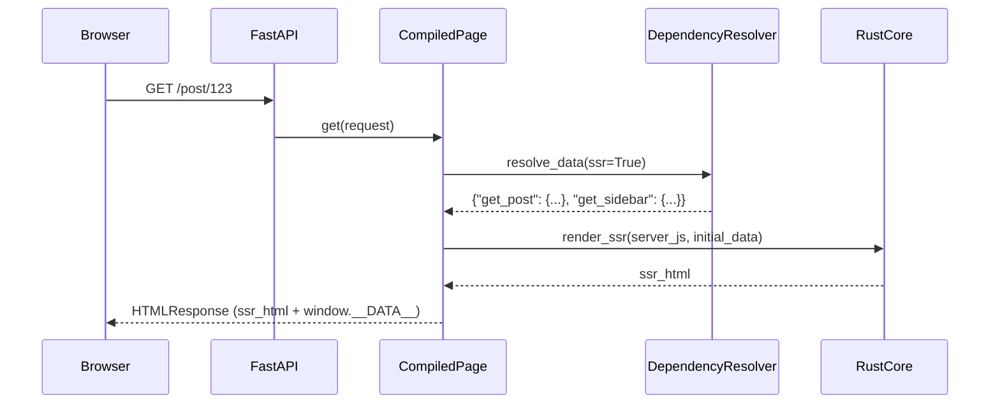
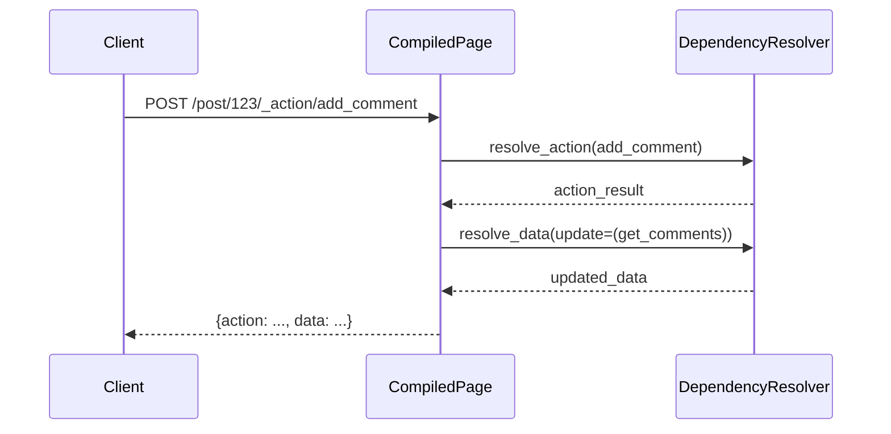
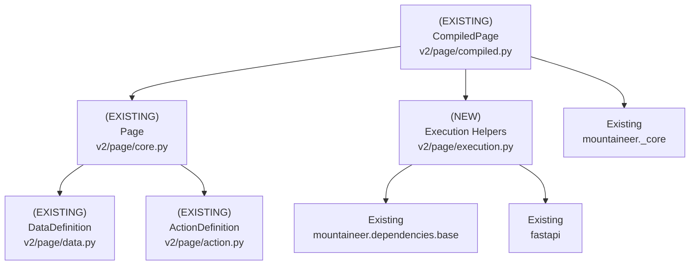

# Design Document: Mountaineer V2 Data and Action API

## Overview

### High-Level Description

Mountaineer V2 supports page registration and SSR GET responses.
It does not execute data loaders or actions yet.
This design adds first-class `@page.data` loaders and a unified `@page.action` decorator.
The data system mirrors FastAPI route/dependency semantics and supports `Depends` in data/action signatures.
SSR requests execute `ssr=True` data loaders and inject results into `window.__DATA__` in the HTML shell.
Data loaders are exposed as HTTP GET endpoints by default.
This includes `ssr=True` loaders.
Actions are always exposed as HTTP endpoints.
Actions can declare `update=(...)` to re-run one or more data loaders.
Pages may optionally define a shared params model (Pydantic `BaseModel`).
When provided, all data/action handlers must accept that params model as their first argument.
Additional handler parameters continue to use standard FastAPI parsing.

This design keeps V2 isolated from V1 controller/layout/graph code.
It continues to use the Rust core for SSR.
If the page path includes a dynamic segment, it must be named `{slug}`.
The params model must include `slug`.

**V1 -> V2 mapping**:

- `ControllerBase.render()` -> `@page.data(ssr=True)` (one or many loaders)
- `@passthrough` -> `@page.action()` without `update`
- `@sideeffect` -> `@page.action(update=(...))`

### Goals

- Support multiple `@page.data` loaders with `ssr=True/False` flags.
- Allow `fastapi.Depends` (and standard FastAPI parameter parsing) in data/action signatures.
- Provide a shared params model for data/action handlers (optional).
- Standardize the path param name: when present it is always `slug`.
- Add data/action routes to `CompiledPage` in a predictable structure.
- Preserve path params for data/action routes.
- Return a unified action response that includes both action output and any updated data results.
- Provide comprehensive test coverage for data execution, dependency resolution, and params-model enforcement.
- Use HTTP `GET` for data endpoints by default.
- Expose `ssr=True` data loaders as HTTP endpoints by default.

### Non-Goals

- Client-side type generation or TypeScript interface updates.
- V1 compatibility or adapters for `ControllerBase`.
- Data caching, incremental invalidation, or background task execution.
- Streaming data or SSE support for data loaders (future enhancement).

### Decisions

- Data endpoints use HTTP `GET` by default.
- `ssr=True` data loaders are exposed as HTTP endpoints by default.
- `window.__DATA__` metadata beyond the raw data payload is currently undefined.
- If a page has a dynamic path segment, it must be named `{slug}`.
- The params model must include a `slug` field when `{slug}` is present.
- If a params model is provided, handlers must accept it as their first argument.
- The `slug` field may be optional when the path does not include `{slug}`.

## Workflows

### Workflow 1: SSR Page Render with Data Loaders

#### Description

On a GET request to the page path, `CompiledPage` executes all `@page.data(ssr=True)` loaders.
It uses FastAPI dependency resolution.
The resulting data payload is embedded into `window.__DATA__` and passed to the Rust SSR renderer.

#### Usage Example

```python
from pathlib import Path
from fastapi import Depends, Request
from pydantic import BaseModel
from mountaineer.v2 import Page

async def get_current_user(request: Request) -> str:
    return request.headers.get("x-user", "anonymous")

class PostParams(BaseModel):
    slug: str

page = Page(
    view=Path("views/Post.tsx"),
    path="/post/{slug}",
    params=PostParams,
)

@page.data(ssr=True)
async def get_post(params: PostParams, user: str = Depends(get_current_user)) -> dict:
    return {"slug": params.slug, "user": user}

@page.data(ssr=True)
async def get_sidebar() -> dict:
    return {"items": ["a", "b"]}
```

#### Call Graph

```mermaid
graph TD
    A[HTTP GET /post/{slug}] --> B[CompiledPage.get]
    B --> C[resolve_data(ssr=True)]
    C --> D[fastapi.solve_dependencies]
    D --> E[get_post handler]
    D --> F[get_sidebar handler]
    C --> G[initial_data dict]
    B --> H[build_page_html]
    H --> I[mountaineer._core.render_ssr]
    I --> J[HTMLResponse]
```

#### Sequence Diagram



#### Key Components

- **Page** (`src/mountaineer/v2/page/core.py:Page`) - Registers data/actions and enforces params-model rules.
- **CompiledPage** (`src/mountaineer/v2/page/compiled.py:CompiledPage`) - GET handler + SSR data execution.
- **DataDefinition** (`src/mountaineer/v2/page/data.py:DataDefinition`) - Data loader metadata.
- **Dependency Resolver** (`src/mountaineer/v2/page/execution.py`) - Uses FastAPI dependency resolution.

### Workflow 2: Client Fetch for Non-SSR Data

#### Description

Data loaders with `ssr=False` are not executed during initial SSR.
They are exposed as HTTP GET endpoints for client-side fetching.
The endpoint uses the same dependency resolution pipeline.

#### Usage Example

```python
@page.data(ssr=False)
async def get_comments(params: PostParams) -> list[dict]:
    return [{"id": 1, "slug": params.slug}]

# Client request
# GET /post/123/_data/get_comments
# Response: {"data": {"get_comments": [...]}}
```

#### Call Graph

```mermaid
graph TD
    A[Client GET /post/{slug}/_data/get_comments] --> B[CompiledPage.data_endpoint]
    B --> C[resolve_data(name=get_comments)]
    C --> D[fastapi.solve_dependencies]
    D --> E[get_comments handler]
    C --> F[DataResponse payload]
```

#### Key Components

- **CompiledPage** (`src/mountaineer/v2/page/compiled.py`) - Registers per-loader data routes.
- **DataDefinition** (`src/mountaineer/v2/page/data.py`) - `ssr=False` and `expose=True`.
- **Page path rule** (`src/mountaineer/v2/page/core.py:Page.__post_init__`) - Enforces `{slug}` naming.

### Workflow 3: Action Invocation with Data Reload

#### Description

Actions are POST endpoints exposed under the page prefix.
An action may declare `update=(...)` to re-run data loaders and return their results alongside the action output.

#### Usage Example

```python
@page.action(update=(get_comments,))
async def add_comment(params: PostParams, body: dict) -> dict:
    # create comment
    return {"status": "ok"}

# POST /post/123/_action/add_comment
# Response:
# {
#   "action": {"status": "ok"},
#   "data": {"get_comments": [...]}
# }
```

#### Call Graph

```mermaid
graph TD
    A[POST /post/{slug}/_action/add_comment] --> B[CompiledPage.action_endpoint]
    B --> C[resolve_action]
    C --> D[fastapi.solve_dependencies]
    D --> E[action handler]
    C --> F[resolve_data(update loaders)]
    F --> G[DataResponse payload]
    C --> H[ActionResponse payload]
```

#### Sequence Diagram



#### Key Components

- **ActionDefinition** (`src/mountaineer/v2/page/action.py`) - Action metadata + update mapping.
- **CompiledPage** (`src/mountaineer/v2/page/compiled.py`) - Action endpoints.
- **Execution helpers** (`src/mountaineer/v2/page/execution.py`) - Runs action + optional reloads.

## Dependencies



## Detailed Design

### Module Structure

```text
src/mountaineer/v2/
├── app.py
├── bundler.py
├── page_renderer.py
└── page/
    ├── __init__.py
    ├── core.py                # Page + data/action decorators
    ├── compiled.py            # Router + SSR/data/action endpoints
    ├── data.py                # DataDefinition (ssr/expose metadata)
    ├── action.py              # ActionDefinition (update mapping)
    └── execution.py           # Dependency resolution + data/action execution
src/mountaineer/__tests__/v2/
├── test_page.py               # Existing + updated decorator tests
├── test_compiled_page.py      # Routes for data/action + SSR payload
├── test_execution.py          # Data/action execution w/ Depends
└── test_v2_integration.py     # End-to-end SSR + data + action
```

### API Design

#### `src/mountaineer/v2/page/data.py`

Data loader metadata and exposure policy.

```python
from collections.abc import Awaitable, Callable
from dataclasses import dataclass
from typing import Generic, TypeVar

T = TypeVar("T")

@dataclass(slots=True, kw_only=True)
class DataDefinition(Generic[T]):
    name: str
    handler: Callable[..., Awaitable[T]]
    ssr: bool
    expose: bool
    # 1. expose defaults to True when registered (including ssr=True loaders)
```

#### `src/mountaineer/v2/page/action.py`

Unified action metadata.

```python
from collections.abc import Awaitable, Callable
from dataclasses import dataclass

@dataclass(slots=True, kw_only=True)
class ActionDefinition:
    name: str
    handler: Callable[..., Awaitable[object]]
    update: tuple[str, ...] | None
```

#### `src/mountaineer/v2/page/core.py`

Page registration, params-model enforcement, and decorator behavior.

```python
from dataclasses import dataclass, field
from pathlib import Path
from typing import TYPE_CHECKING, Protocol, TypeVar

from pydantic import BaseModel

from mountaineer.v2.page.action import ActionDefinition
from mountaineer.v2.page.data import DataDefinition

if TYPE_CHECKING:
    from collections.abc import Awaitable, Callable
    from mountaineer.v2.page.compiled import CompiledPage

class NamedCallable(Protocol):
    __name__: str
    def __call__(self, *args: object, **kwargs: object) -> Awaitable[object]: ...

F = TypeVar("F", bound=NamedCallable)

@dataclass(slots=True, kw_only=True)
class Page:
    view: Path
    path: str
    params: type[BaseModel] | None = None
    _data: list[DataDefinition[object]] = field(default_factory=list)
    _actions: dict[str, ActionDefinition] = field(default_factory=dict)

    def __post_init__(self) -> None: ...
    # 1. Validate path format (existing behavior)
    # 2. If a path param exists, enforce it is named {slug}
    # 3. If path has {slug}, require params model with slug field
    # 4. If params model exists, allow slug to be optional unless path requires it

    def __call__(self, *, server_js: str, client_js: str, ssr_timeout: int) -> CompiledPage: ...

    def data(self, *, ssr: bool, expose: bool | None = None) -> Callable[[F], F]: ...
    # 1. Register DataDefinition(name, handler, ssr, expose)
    # 2. If params model is set, require handler's first arg to match it
    # 3. Preserve registration order

    def action(self, *, update: tuple[NamedCallable, ...] | None = None) -> Callable[[F], F]: ...
    # 1. Validate name uniqueness
    # 2. Map update handlers to DataDefinition names
    # 3. If params model is set, require handler's first arg to match it
```

#### `src/mountaineer/v2/page/execution.py`

Dependency resolution and execution helpers used by CompiledPage.

```python
from collections.abc import Awaitable, Callable
from contextlib import asynccontextmanager
from typing import Any

from fastapi import Depends, Request
from pydantic import BaseModel

from mountaineer.dependencies import get_function_dependencies

async def resolve_call(
    *,
    handler: Callable[..., Awaitable[Any]],
    request: Request,
    path: str,
    params_model: type[BaseModel] | None = None,
    dependency_overrides: dict[Callable, Callable] | None = None,
) -> Any: ...
# 1. If params_model is set, build a wrapper callable that injects `params: ParamsModel = Depends()`
# 2. Use get_function_dependencies(callable=wrapper_or_handler, url=path, request=request, overrides=...)
# 3. Call handler(params, **resolved_values_without_params)
# 4. Await result and return

async def resolve_data(
    *,
    definitions: list[DataDefinition[object]],
    request: Request,
    path: str,
    params_model: type[BaseModel] | None,
    overrides: dict[Callable, Callable] | None,
) -> dict[str, object]: ...
# 1. Filter definitions by ssr/expose as requested
# 2. Resolve in registration order (optionally via asyncio.gather)
# 3. Return {name: value}

async def resolve_action(
    *,
    definition: ActionDefinition,
    request: Request,
    path: str,
    overrides: dict[Callable, Callable] | None,
) -> object: ...
# 1. Resolve dependencies and call handler
# 2. Return action result
```

#### `src/mountaineer/v2/page/compiled.py`

Compiled page router and endpoints for SSR, data, and actions.

```python
from dataclasses import dataclass

from fastapi import APIRouter, Request
from fastapi.responses import HTMLResponse, JSONResponse

from mountaineer.v2.page.core import Page
from mountaineer.v2.page.execution import resolve_action, resolve_data
from mountaineer.v2.page_renderer import build_page_html

@dataclass(slots=True, kw_only=True)
class CompiledPage:
    page: Page
    server_js: str
    client_js: str
    ssr_timeout: int

    def __call__(self) -> APIRouter: ...
    # 1. Create APIRouter(prefix=page.path)
    # 2. GET "" -> self.get
    # 3. Add GET /_data/<name> for expose=True data loaders
    # 4. Add /_action/<name> for all actions

    async def get(self, request: Request) -> HTMLResponse: ...
    # 1. Execute ssr=True data loaders with params_model=page.params
    # 2. Build initial_data payload
    # 3. build_page_html(..., initial_data)
    # 4. Return HTMLResponse

    async def data_endpoint(self, *, name: str, request: Request) -> JSONResponse: ...
    # 1. Execute the named data loader with params_model=page.params
    # 2. Return {"data": {name: result}}

    async def action_endpoint(self, *, name: str, request: Request) -> JSONResponse: ...
    # 1. Execute action handler with params_model=page.params
    # 2. If update declared, run data loaders and attach results
    # 3. Return {"action": result, "data": {...}} (data optional)
```

## Testing Strategy

Tests live under `src/mountaineer/__tests__/v2/` and mirror module structure.

**`test_page.py`**

- Enforce path param name is `{slug}` when dynamic path segments are used
- Require params model when path includes `{slug}`
- Require `slug` field on params model when path includes `{slug}`
- Enforce handler first-argument type matches params model (when provided)
- Allow optional `slug` when the path has no dynamic segment
- Preserve data/action registration order and function identity

**`test_execution.py`**

- Resolve data loader with `Depends` returning a value
- Resolve data loader with `Request` injection
- Resolve action handler with `Depends` and verify return value
- Resolve action update reload using synthetic request (no body leakage)

**`test_compiled_page.py`**

- SSR GET executes only `ssr=True` loaders
- `ssr=False` loaders are not executed in SSR
- Data routes created only for `expose=True` loaders
- Action routes created for all actions
- Response payload shape for data/action endpoints

**`test_v2_integration.py`**

- FastAPI `TestClient` GET page returns HTML with `window.__DATA__`
- Use the params model in the SSR handler
- GET `/_data/<name>` returns JSON payload with resolved data
- POST `/_action/<name>` returns action payload + reloaded data
- Path params resolved from prefix routes (`/post/my-slug/_data/...`)

### Edge Cases

- Action update references missing loader (ValueError)
- Data/action handlers returning non-JSONable objects (ensure error surfaced)
- Duplicate action names
- Path param not named `{slug}` (explicit error)
- Path includes `{slug}` but params model missing `slug` field (explicit error)
- Params model provided but handler does not accept it as first argument (explicit error)

## Implementation

### Implementation Order

1. **DataDefinition updates** (`src/mountaineer/v2/page/data.py`) - add `expose` and defaults
2. **Execution helpers** (`src/mountaineer/v2/page/execution.py`) - uses existing dependency resolver
3. **Page registration** (`src/mountaineer/v2/page/core.py`) - enforce params-model + `{slug}` rules
4. **CompiledPage routing** (`src/mountaineer/v2/page/compiled.py`) - add data/action routes
5. **Tests** (`src/mountaineer/__tests__/v2/...`) - unit + integration updates

### Tasks

- [x] **Page path + params-model validation** (`v2/page/core.py`)
  - [x] Parse `Page.path` for `{param}` segments
  - [x] If any dynamic param exists:
    - [x] enforce there is exactly one param
    - [x] enforce the name is `slug`
  - [x] If path includes `{slug}`, require `Page.params` to be provided
  - [x] Validate `Page.params` declares a `slug` field when required by path
  - [x] Add error messages that show the invalid path
  - [x] Mention the required `{slug}` format in error text
  - [x] Unit tests in `__tests__/v2/test_page.py`:
    - [x] accept `/` and static paths with no params
    - [x] reject `/post/{post_id}` (wrong name)
    - [x] reject `/post/{slug}/{other}` (multiple params)
    - [x] reject `/post/{slug}` when `params` is missing or lacks `slug`

- [x] **DataDefinition + Page.data registration** (`v2/page/data.py`, `v2/page/core.py`)
  - [x] Extend `DataDefinition` with `expose: bool`
  - [x] Default `expose=True` for all data loaders (including `ssr=True`)
  - [x] Allow explicit `expose=False` to hide a loader from HTTP endpoints
  - [x] If `Page.params` is set, require handler first arg annotation to match
  - [x] Treat remaining handler params as standard FastAPI params
  - [x] Update `test_page.py` to cover:
    - [x] expose defaults for `ssr=True` and `ssr=False`
    - [x] handler first-argument enforcement when `params` is set
    - [x] preserved registration order

- [x] **ActionDefinition + Page.action registration** (`v2/page/action.py`, `v2/page/core.py`)
  - [x] If `Page.params` is set, require handler first arg annotation to match
  - [x] Keep `update=(...)` validation consistent with current behavior
  - [x] Add tests for:
    - [x] handler first-argument enforcement when `params` is set
    - [x] duplicate action name detection

- [x] **Execution helpers** (`v2/page/execution.py`)
  - [x] Implement `resolve_call()` using `get_function_dependencies(...)`
  - [x] If `params_model` is set, build a wrapper with `params: ParamsModel = Depends()`
  - [x] Ensure resolved `params` value is passed as the first argument to the handler
  - [x] Ensure `Request` is available to `Depends(Request)`
  - [x] Support explicit `request: Request` parameters
  - [x] Implement `resolve_data()`:
    - [x] filter by `ssr` or by explicit name
    - [x] preserve registration order in output dict
  - [x] Implement `resolve_action()` that returns the action result as-is
  - [x] Unit tests in `test_execution.py`:
    - [x] dependency injection with `Depends`
    - [x] `Request` injection
    - [x] params model populated from path/query values
    - [x] override behavior via `dependency_overrides`

- [x] **CompiledPage routing** (`v2/page/compiled.py`)
  - [x] Use `APIRouter(prefix=page.path)` for data/action routes
  - [x] Register GET `/_data/{name}` routes for `expose=True` data loaders
  - [x] Register POST `/_action/{name}` routes for all actions
  - [x] Implement `data_endpoint()` returning `{\"data\": {name: value}}`
  - [x] Implement `action_endpoint()` returning `{\"action\": value, \"data\": {...}}`
  - [x] Update `test_compiled_page.py` for:
    - [x] route methods and count
    - [x] payload shape for GET data endpoint
    - [x] payload shape for POST action endpoint

- [x] **SSR data injection** (`v2/page/compiled.py`, `v2/page_renderer.py`)
  - [x] Execute only `ssr=True` loaders during GET
  - [x] Serialize results into `window.__DATA__`
  - [x] Ensure non-SSR loaders are not executed in SSR flow
  - [x] Update `test_compiled_page.py` to assert `window.__DATA__` contains SSR payload

- [x] **Integration tests** (`__tests__/v2/test_v2_integration.py`)
  - [x] End-to-end SSR GET returns HTML with SSR data only
  - [x] GET `/_data/<name>` returns JSON payload using path params
  - [x] POST `/_action/<name>` returns action result plus updated data
  - [x] Verify `Depends` works across SSR, data, and action endpoints

## Open Questions

1. What is the long-term shape of `window.__DATA__` metadata (endpoints, root_path)?
Current plan only requires the data payload.

## Future Enhancements

- Client-side type generation and typed hooks for data/actions
- Caching and invalidation for data loaders
- Optional parallel execution with concurrency limits
- Streaming/SSE for large data loaders

## Libraries

### Existing Libraries

| Library | Current Version | Purpose | Dependency Group |
|---------|-----------------|---------|------------------|
| `fastapi` | existing | Routing + dependency injection | core |
| `pydantic` | existing | Data models and validation | core |

## Alternative Approaches

### Approach 1: Embed Data Loaders as FastAPI Dependencies in SSR Handler

**Description**: Dynamically build a wrapper GET handler whose signature includes each data loader via `Depends`.

**Pros**:

- Leverages FastAPI for all dependency resolution and request parsing
- Clear OpenAPI exposure for data dependencies

**Cons**:

- Hard to generate dynamic signatures at runtime
- Complicates testing and introspection

**Why not chosen**: A dedicated execution helper is simpler.
It is more explicit for dynamic loader sets.

### Approach 2: Separate Data Router Not Under Page Prefix

**Description**: Register data routes under a global prefix (ex: `/__data__/page_id/...`).

**Pros**:

- Centralized routing and easier client discovery

**Cons**:

- Loses implicit path params from page routes
- Harder to map to FastAPI-style parameters

**Why not chosen**: Page-prefixed routes preserve path param resolution.
They also mirror FastAPI routing patterns.
