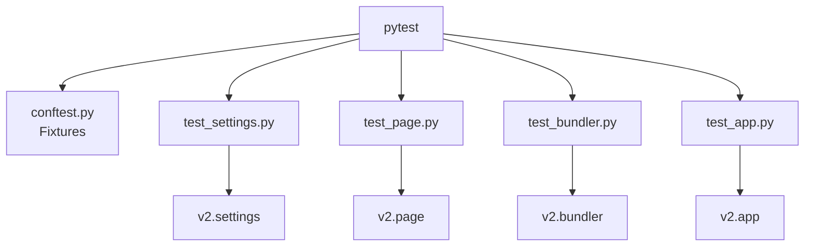
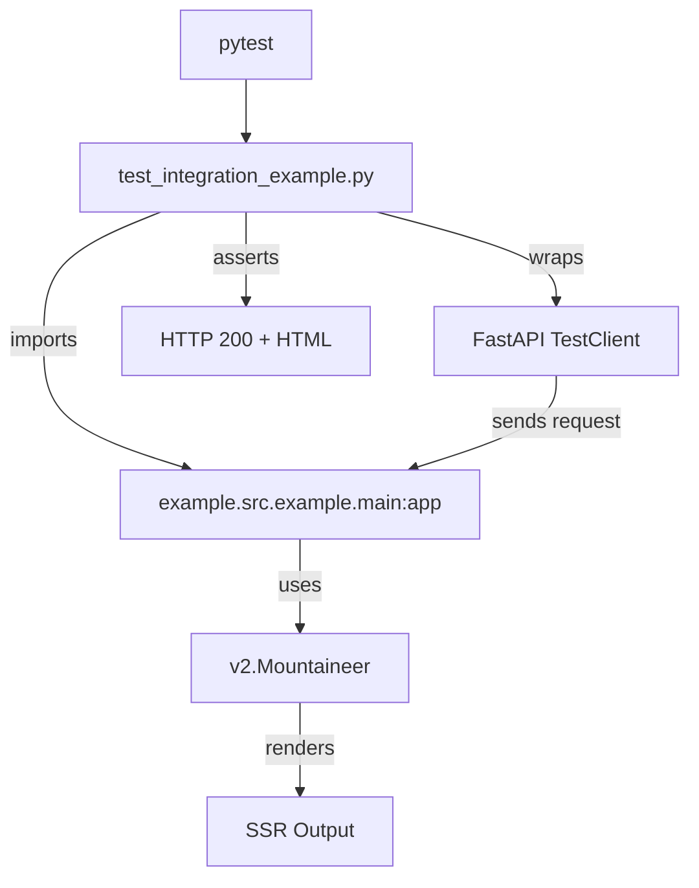

# Design Document: V2 Testing Infrastructure

## Overview

### High-Level Description

This design proposes a comprehensive testing infrastructure for Mountaineer V2.
Currently, the V2 codebase (`src/mountaineer/v2/`) lacks implemented tests.
This is despite the strategy outlined in previous designs.
This document details the implementation of unit tests for all V2 components and a robust integration test suite.
Crucially, it includes testing the `example` project to verify end-to-end functionality.
The testing framework will enforce strict isolation from V1 modules (`mountaineer.app`, `mountaineer.controller`, etc.).
This ensures V2 evolves independently.

### Goals

- Implement unit tests for all V2 modules: `settings`, `page`, `bundler`, `app`, `html`.
- Implement integration tests using the existing `example` project as a test subject.
- Ensure 100% test coverage for V2 logic (excluding Rust `_core` internals, which are mocked in unit tests).
- Verify that V2 tests do not import or depend on V1 Python modules.
- Use standard `pytest` and `fastapi.testclient.TestClient` patterns.

### Non-Goals

- Testing V1 components.
- Refactoring V2 implementation code (unless necessary for testability).
- Writing tests for the Rust `_core` extension itself (we test the Python bindings/wrappers).

## Workflows

### Workflow 1: Unit Testing V2 Components

#### Description

Developers run `uv run pytest src/mountaineer/v2` to verify individual components.
Tests mock external dependencies (like the file system or Rust bundler) to run fast and reliably.

#### Usage Example

```bash
uv run pytest src/mountaineer/v2/__tests__/test_settings.py
```

#### Call Graph



#### Key Components

- **Conftest** (`src/mountaineer/v2/__tests__/conftest.py`) - Shared fixtures (mocked bundler, simple page objects).
- **Test Modules** - One test file per source file (e.g., `test_settings.py` for `settings.py`).

### Workflow 2: Integration Testing with Example Project

#### Description

A dedicated integration test module adds the `example` project to the python path, imports its `main` app, and tests
endpoints against a real running V2 instance.

#### Usage Example

```python
# src/mountaineer/v2/__tests__/test_integration_example.py
from fastapi.testclient import TestClient
from example.main import app

def test_example_home():
    client = TestClient(app)
    response = client.get("/")
    assert response.status_code == 200
    assert "<div id=\"root\">" in response.text
```

#### Call Graph



## Dependencies

```mermaid
graph TD
    Pytest[pytest]
    TestClient[fastapi.testclient.TestClient]
    Mock[unittest.mock]
    V2Code[src/mountaineer/v2/*]
    ExampleCode[example/src/example/*]
    RustCore[mountaineer._core (Mocked in Unit, Real in Integ)]

    V2Tests --> Pytest
    V2Tests --> TestClient
    V2Tests --> Mock
    V2Tests --> V2Code
    V2IntegTests --> ExampleCode
    V2IntegTests --> RustCore
```

## Detailed Design

### Module Structure

```text
src/mountaineer/v2/__tests__/
├── conftest.py                 # Fixtures: mocked bundler, example_path setup
├── test_settings.py            # Tests for v2/settings.py
├── test_bundler.py             # Tests for v2/bundler.py (mocks _core)
├── test_page.py                # Tests for v2/page/* (core, compiled, data, action)
├── test_html.py                # Tests for v2/html.py
├── test_app.py                 # Tests for v2/app.py (Mountaineer class)
└── test_integration_example.py # End-to-end tests using the example project
```

### API Design

#### `src/mountaineer/v2/__tests__/conftest.py`

Setup for tests, including path manipulation to include the example project.

```python
import sys
from pathlib import Path
import pytest

@pytest.fixture(scope="session")
def example_path():
    # Helper to find the example directory relative to this file
    repo_root = Path(__file__).parents[4] # Adjust based on actual depth
    example_src = repo_root / "example" / "src"
    if str(example_src) not in sys.path:
        sys.path.insert(0, str(example_src))
    yield example_src

@pytest.fixture
def mock_bundler(mocker):
    # Mock the internal _core bundling calls to return dummy JS
    mock = mocker.patch("mountaineer.v2.bundler.mountaineer_rs")
    mock.compile_independent_bundles.return_value = "server_js", "client_js"
    return mock
```

#### `src/mountaineer/v2/__tests__/test_settings.py`

Validate configuration loading.

```python
from mountaineer.v2.settings import Settings

def test_settings_defaults():
    s = Settings(view_root="/tmp", node_modules_path="/tmp")
    assert s.PRODUCTION is False
    assert s.ssr_timeout == 10

def test_settings_env_override(monkeypatch):
    monkeypatch.setenv("MOUNTAINEER_SSR_TIMEOUT", "20")
    s = Settings(view_root="/tmp", node_modules_path="/tmp")
    assert s.ssr_timeout == 20
```

#### `src/mountaineer/v2/__tests__/test_page.py`

Test page registration, decorators, and compilation.

```python
from mountaineer.v2 import Page

def test_page_registration():
    p = Page(view="path/to/view.tsx", path="/test")

    @p.data(ssr=True)
    async def load_data():
        pass

    assert len(p._data) == 1
    assert p._data[0].name == "load_data"

def test_page_compilation():
    p = Page(view="view.tsx", path="/")
    compiled = p(server_js="Server", client_js="Client", ssr_timeout=5)
    assert compiled.server_js == "Server"
```

#### `src/mountaineer/v2/__tests__/test_integration_example.py`

The critical piece: testing the actual example app.

```python
from fastapi.testclient import TestClient
import pytest

# Requires the 'example_path' fixture to ensure import works
def test_example_home_endpoint(example_path):
    # Import inside test to avoid ModuleNotFoundError at collection time
    from example.main import app

    client = TestClient(app)
    response = client.get("/")

    assert response.status_code == 200
    assert "text/html" in response.headers["content-type"]
    # Verify V2 SSR structure
    assert '<div id="root">' in response.text
    # Verify content specific to the example (if known)
    # assert "Welcome" in response.text
```

#### `src/mountaineer/v2/__tests__/test_isolation.py`

Ensure no V1 leakage.

```python
import sys
from mountaineer.v2 import app

def test_no_v1_imports():
    # Inspect sys.modules or walk the v2 AST to ensure
    # no imports from mountaineer.app, mountaineer.controller, etc.
    # This might be static analysis or runtime check.
    pass
```

## Testing Strategy

1. **Unit Tests (Mocked):**
   - Verify logic of `Bundler`, `Page`, `Mountaineer` without hitting the file system or Rust compiler heavily.
   - Mock `mountaineer._core` interactions.
   - Verify correct propagation of `Settings`.

2. **Integration Tests (Real):**
   - `test_integration_example.py` is the primary integration test.
   - It uses the *real* `example/src/example/main.py`.
   - It effectively tests: `Settings` -> `Mountaineer` -> `Bundler` (compilation) -> `Page` -> `SSR` -> `Response`.
   - This verifies that the example project configuration matches the library expectations.

3. **V1 Isolation:**
   - We will strictly avoid importing any `mountaineer.*` modules outside of `mountaineer.v2` and `mountaineer._core`.
   - Manual verification during implementation + potential static analysis test.

## Implementation

### Implementation Order

1. **Test Scaffolding:** Create `conftest.py` with `example_path` fixture.
2. **Unit Tests:** Implement `test_settings.py`, `test_page.py`, `test_bundler.py`, `test_html.py`.
3. **App Logic:** Implement `test_app.py` for the main `Mountaineer` class.
4. **Integration:** Implement `test_integration_example.py` and debug any path/import issues with the example project.

### Tasks

- [x] **Infrastructure**
  - [x] Create `src/mountaineer/v2/__tests__/conftest.py`
  - [x] Implement `example_path` fixture to modify `sys.path`
  - [x] Implement `mock_bundler` fixture

- [x] **Unit Tests**
  - [x] Write `test_settings.py`: Env loading, defaults, validation.
  - [x] Write `test_page.py`: Decorators, data/action registry, `CompiledPage` factory.
  - [x] Write `test_bundler.py`: Mocked calls to `_core`, path resolution.
  - [x] Write `test_html.py`: HTML string construction, injection of data/scripts. (See `test_page_renderer.py`)
  - [x] Write `test_app.py`: `include_page`, FastAPI mounting, duplicate path detection.

- [x] **Integration Tests**
  - [x] Write `test_integration_example.py`:
    - [x] Import `example.main`.
    - [x] `TestClient` GET `/`.
    - [x] `TestClient` GET `/detail/123` (parameterized route).
    - [x] Assert HTML structure (SSR worked).

## Open Questions

- **Rust Extension in Tests:** Will `mountaineer._core` work in the test environment without explicitly building
  the rust extension first?
  - *Assumption:* Yes, `uv` environment usually has the extension built/installed.
    If not, we might need a `uv run maturin develop` step.
    Typically, however, `uv run pytest` assumes the environment is ready.

## Future Enhancements

- Add tests for Hot Module Replacement (HMR) logic (once implemented in V2).
- Add specific tests for the V2 client-side Typescript generation (Phase 2).

## Libraries

### New Libraries

None. (Uses existing `pytest`, `fastapi`, `httpx`).

### Existing Libraries

| Library | Version | Purpose | Dependency Group |
|---------|---------|---------|------------------|
| `pytest` | existing | Test runner | `dev` |
| `fastapi` | existing | TestClient | `core` |
| `httpx` | existing | TestClient backend | `core` |
